# RISCV_Automatic-Sanitizer-Dispenser
This github repository summarizes the progress made in the ASIC class for the riscv_project.

## Aim
The project's goal is to design an automatic sanitizer dispenser utilizing a specialized RISCV processor for bottle refill alerts and touch-free sanitizer distribution, with the objective of minimizing the machine's footprint, energy consumption, and overall expenses.

## Working
An infrared sensor is employed to detect the presence of a hand. Upon hand detection, the solenoid valve is activated. The sanitizer is directed through the flow sensor via the open solenoid valve, allowing the flow sensor to calculate the quantity of sanitizer dispensed. The system is configured to accommodate a sanitizer bottle with a capacity of half a liter. Upon detecting the dispensing of half a liter, the flow sensor triggers a buzzer, signaling the need for a sanitizer bottle refill.

## Circuit
This is not the depiction of the final circuit. <br>


## Block Diagram


## C Code
```
/*
#include<stdio.h>
#include<stdlib.h>
*/
int main()
{ 
    //int printer,printer1;
    
    // Variable Declaration
    int ir_sen_ip_reg;
    int mask1 = 0xFFFFFFE3;
    int mask2 = 0xFFFFFFFB;
    int ir_sen_ip;//=1;//=1;
    int solenoid_valve_op=0; //= 1;
    int led_op = 0;
    int buzzer = 0;
    int counter_h = 0;
    int counter_l = 0;
    int reset_button = 0;
    int water_used=0;
    int solenoid_reg, led_reg, buzzer_reg;
    solenoid_reg = solenoid_valve_op*4;
    led_reg = led_op*8;
    buzzer_reg = buzzer*16;
    
    /*
    asm volatile(
    	"addi x30, x30, 1\n\t"
    	:
    	:
    	:"x30"
    	);
    */
    
    // Intialize the registers 
    asm volatile(
	"and x30, x30, %3\n\t"
	"or x30, x30, %0\n\t"
	"or x30, x30, %1\n\t"
	"or x30, x30, %2\n\t" 
	:
	:"r"(solenoid_reg),"r"(led_reg),"r"(buzzer_reg),"r"(mask1)
	:"x30"
	);

    // Actual Program execution brgins here
		
    while(1){
    //reset = digital_read(0);
    
     //Read Reset button input
    	asm volatile(
	"andi %0, x30, 1\n\t"
	:"=r"(reset_button)
	:
	:"x30"
	);
	
	/*
	asm volatile(
    	"addi %0, x30, 0\n\t"
    	:"=r"(printer)
    	:
    	:"x30"
    	);
    	printf("Printer = %d\n",printer);
	//printf("Inside while 1\n");
	//printf("Reset Button_val=%d\n",reset_button);
	*/
    if(reset_button)
    {
    	// printf("reset_cond\n");
        //break;
        solenoid_valve_op = 0;
        led_op = 0;
        buzzer = 0;
        counter_h = 0;
        counter_l = 0;
        water_used = 0;
        //digital_write(4,solenoid_valve_op);
        //digital_write(5,led_op);
        //digital_write(6,buzzer);
        solenoid_reg = solenoid_valve_op*4;
        led_reg = led_op*8;
        buzzer_reg = buzzer*16;
        asm volatile(
        "and x30, x30, %3\n\t"
	"or x30, x30,%0 \n\t"
	"or x30, x30,%1 \n\t"
	"or x30, x30,%2 \n\t" 
	:
	:"r"(solenoid_reg),"r"(led_reg),"r"(buzzer_reg),"r"(mask1)
	:"x30"
	);
	
	/*
	asm volatile(
    	"addi %0, x30, 0\n\t"
    	:"=r"(printer1)
    	:
    	:"x30"
    	);
    	printf("Printer1 = %d\n",printer1);
    	*/
    }
    else
    {
    /*
    asm volatile(
    	"addi %0, x30, 0\n\t"
    	:"=r"(printer1)
    	:
    	:"x30"
    	);
    	printf("Printer1 = %d\n",printer1);
    printf("Led_val = %d, Buzzer_val = %d, Reset_button = %d, IR_sensp = %d, solenoid_valve_op=%d\n",led_op,buzzer,reset_button,ir_sen_ip,solenoid_valve_op);
    //break;
    //if(!led_op)
    //	{printf("Hi"); break;}
    */
     	
    if(!led_op && !buzzer && !reset_button){
     //read();
      /*
       asm volatile(
    	"addi %0, x30, 0\n\t"
    	:"=r"(printer)
    	:
    	:"x30"
    	);
    	printf("Printer = %d\n",printer);
        // = 2;
    //ir_sen_ip = digital_read(1);
       */
        asm volatile(
	"andi %0, x30, 2\n\t"
	:"=r"(ir_sen_ip_reg)
	:
	:"x30"
	);
	
    
    ir_sen_ip = ir_sen_ip_reg>>1;
    // printf("Led_val = %d, Buzzer_val = %d, Reset_button = %d, IR_sensp = %d, solenoid_valve_op=%d\n",led_op,buzzer,reset_button,ir_sen_ip,solenoid_valve_op);
    // break;
    if(ir_sen_ip)
    {
    	// printf("got ir_sens\n");
    	
        solenoid_valve_op = 1;
        solenoid_reg = solenoid_valve_op*4;
        asm volatile(
	"and x30, x30, %1\n\t"
	"or x30, x30,%0 \n\t"
	:
	:"r"(solenoid_reg),"r"(mask2)
	:"x30"
	);
        //digital_write(4,solenoid_valve_op);
        counter_h++;
        //bottle_status();
        int time = counter_h + counter_l;
    	int freq = 0;
    	int dividend = 100, divisor = time;
    	while (dividend >= divisor) {
        dividend -= divisor;
        freq++;
    	}
       	int water = freq;
    	int ls = water * 17;
    	//int led_reg;
    	//int buzzer_reg;
    	water_used = water_used+ls;
    	if(ls>102)
   	{
   	//printf("Inside ls if\n");
        // break;
        led_op = 1;
        buzzer = 1;   
        solenoid_valve_op=0;
      //  break;
        //digital_write(5,led_op);
        //digital_write(6,buzzer);
        led_reg = led_op*8;
        buzzer_reg = buzzer*16;
        solenoid_reg = solenoid_valve_op*4;
        
        asm volatile(
        "and x30, x30, %3\n\t"
	"or x30, x30, %0\n\t"
	"or x30, x30, %1\n\t" 
	"or x30, x30, %2 \n\t"
	:
	:"r"(led_reg),	"r"(buzzer_reg), "r"(solenoid_reg),"r"(mask1) 
	:"x30"
	);
        
    }
        

    }
    else {
    	//printf("ir_sens not_recieved\n");
        solenoid_valve_op = 0;
        //digital_write(4,solenoid_valve_op);
        solenoid_reg = solenoid_valve_op*4;
        asm volatile(
        "and x30, x30, %1\n\t"
	"or x30, x30,%0 \n\t"
	:
	:"r"(solenoid_reg),"r"(mask2)
	:"x30"
	);
        counter_l++;
    }

}
}
}

return 0;
}

```

## GCC Compiler Working

## Assembly code conversion

Compile the c program using RISCV-V GNU Toolchain and dump the assembly code into water_level_assembly.txt using the below commands.

```
riscv64-unknown-elf-gcc -march=rv32i -mabi=ilp32 -ffreestanding  -nostdlib -o ./output.o san_disp.c
riscv64-unknown-elf-objdump -d  -r output.o > assembly.txt
```

## Assembly Code
```

output_new.o:     file format elf32-littleriscv


Disassembly of section .text:

00010054 <main>:
   10054:	fa010113          	addi	sp,sp,-96
   10058:	04812e23          	sw	s0,92(sp)
   1005c:	06010413          	addi	s0,sp,96
   10060:	fc042823          	sw	zero,-48(s0)
   10064:	fe042623          	sw	zero,-20(s0)
   10068:	fe042423          	sw	zero,-24(s0)
   1006c:	fe042223          	sw	zero,-28(s0)
   10070:	fe042023          	sw	zero,-32(s0)
   10074:	fc042623          	sw	zero,-52(s0)
   10078:	fc042e23          	sw	zero,-36(s0)
   1007c:	fd042783          	lw	a5,-48(s0)
   10080:	00279793          	slli	a5,a5,0x2
   10084:	fcf42423          	sw	a5,-56(s0)
   10088:	fec42783          	lw	a5,-20(s0)
   1008c:	00379793          	slli	a5,a5,0x3
   10090:	fcf42223          	sw	a5,-60(s0)
   10094:	fe842783          	lw	a5,-24(s0)
   10098:	00479793          	slli	a5,a5,0x4
   1009c:	fcf42023          	sw	a5,-64(s0)
   100a0:	fc842783          	lw	a5,-56(s0)
   100a4:	fc442703          	lw	a4,-60(s0)
   100a8:	fc042683          	lw	a3,-64(s0)
   100ac:	fe3f7f13          	andi	t5,t5,-29
   100b0:	00ff6f33          	or	t5,t5,a5
   100b4:	00ef6f33          	or	t5,t5,a4
   100b8:	00df6f33          	or	t5,t5,a3
   100bc:	001f7793          	andi	a5,t5,1
   100c0:	fcf42623          	sw	a5,-52(s0)
   100c4:	fcc42783          	lw	a5,-52(s0)
   100c8:	06078063          	beqz	a5,10128 <main+0xd4>
   100cc:	fc042823          	sw	zero,-48(s0)
   100d0:	fe042623          	sw	zero,-20(s0)
   100d4:	fe042423          	sw	zero,-24(s0)
   100d8:	fe042223          	sw	zero,-28(s0)
   100dc:	fe042023          	sw	zero,-32(s0)
   100e0:	fc042e23          	sw	zero,-36(s0)
   100e4:	fd042783          	lw	a5,-48(s0)
   100e8:	00279793          	slli	a5,a5,0x2
   100ec:	fcf42423          	sw	a5,-56(s0)
   100f0:	fec42783          	lw	a5,-20(s0)
   100f4:	00379793          	slli	a5,a5,0x3
   100f8:	fcf42223          	sw	a5,-60(s0)
   100fc:	fe842783          	lw	a5,-24(s0)
   10100:	00479793          	slli	a5,a5,0x4
   10104:	fcf42023          	sw	a5,-64(s0)
   10108:	fc842783          	lw	a5,-56(s0)
   1010c:	fc442703          	lw	a4,-60(s0)
   10110:	fc042683          	lw	a3,-64(s0)
   10114:	fe3f7f13          	andi	t5,t5,-29
   10118:	00ff6f33          	or	t5,t5,a5
   1011c:	00ef6f33          	or	t5,t5,a4
   10120:	00df6f33          	or	t5,t5,a3
   10124:	f99ff06f          	j	100bc <main+0x68>
   10128:	fec42783          	lw	a5,-20(s0)
   1012c:	f80798e3          	bnez	a5,100bc <main+0x68>
   10130:	fe842783          	lw	a5,-24(s0)
   10134:	f80794e3          	bnez	a5,100bc <main+0x68>
   10138:	fcc42783          	lw	a5,-52(s0)
   1013c:	f80790e3          	bnez	a5,100bc <main+0x68>
   10140:	002f7793          	andi	a5,t5,2
   10144:	faf42e23          	sw	a5,-68(s0)
   10148:	fbc42783          	lw	a5,-68(s0)
   1014c:	4017d793          	srai	a5,a5,0x1
   10150:	faf42c23          	sw	a5,-72(s0)
   10154:	fb842783          	lw	a5,-72(s0)
   10158:	10078863          	beqz	a5,10268 <main+0x214>
   1015c:	00100793          	li	a5,1
   10160:	fcf42823          	sw	a5,-48(s0)
   10164:	fd042783          	lw	a5,-48(s0)
   10168:	00279793          	slli	a5,a5,0x2
   1016c:	fcf42423          	sw	a5,-56(s0)
   10170:	fc842783          	lw	a5,-56(s0)
   10174:	ffbf7f13          	andi	t5,t5,-5
   10178:	00ff6f33          	or	t5,t5,a5
   1017c:	fe442783          	lw	a5,-28(s0)
   10180:	00178793          	addi	a5,a5,1
   10184:	fef42223          	sw	a5,-28(s0)
   10188:	fe442703          	lw	a4,-28(s0)
   1018c:	fe042783          	lw	a5,-32(s0)
   10190:	00f707b3          	add	a5,a4,a5
   10194:	faf42a23          	sw	a5,-76(s0)
   10198:	fc042c23          	sw	zero,-40(s0)
   1019c:	06400793          	li	a5,100
   101a0:	fcf42a23          	sw	a5,-44(s0)
   101a4:	fb442783          	lw	a5,-76(s0)
   101a8:	faf42823          	sw	a5,-80(s0)
   101ac:	0200006f          	j	101cc <main+0x178>
   101b0:	fd442703          	lw	a4,-44(s0)
   101b4:	fb042783          	lw	a5,-80(s0)
   101b8:	40f707b3          	sub	a5,a4,a5
   101bc:	fcf42a23          	sw	a5,-44(s0)
   101c0:	fd842783          	lw	a5,-40(s0)
   101c4:	00178793          	addi	a5,a5,1
   101c8:	fcf42c23          	sw	a5,-40(s0)
   101cc:	fd442703          	lw	a4,-44(s0)
   101d0:	fb042783          	lw	a5,-80(s0)
   101d4:	fcf75ee3          	bge	a4,a5,101b0 <main+0x15c>
   101d8:	fd842783          	lw	a5,-40(s0)
   101dc:	faf42623          	sw	a5,-84(s0)
   101e0:	fac42703          	lw	a4,-84(s0)
   101e4:	00070793          	mv	a5,a4
   101e8:	00479793          	slli	a5,a5,0x4
   101ec:	00e787b3          	add	a5,a5,a4
   101f0:	faf42423          	sw	a5,-88(s0)
   101f4:	fdc42703          	lw	a4,-36(s0)
   101f8:	fa842783          	lw	a5,-88(s0)
   101fc:	00f707b3          	add	a5,a4,a5
   10200:	fcf42e23          	sw	a5,-36(s0)
   10204:	fa842703          	lw	a4,-88(s0)
   10208:	06600793          	li	a5,102
   1020c:	eae7d8e3          	bge	a5,a4,100bc <main+0x68>
   10210:	00100793          	li	a5,1
   10214:	fef42623          	sw	a5,-20(s0)
   10218:	00100793          	li	a5,1
   1021c:	fef42423          	sw	a5,-24(s0)
   10220:	fc042823          	sw	zero,-48(s0)
   10224:	fec42783          	lw	a5,-20(s0)
   10228:	00379793          	slli	a5,a5,0x3
   1022c:	fcf42223          	sw	a5,-60(s0)
   10230:	fe842783          	lw	a5,-24(s0)
   10234:	00479793          	slli	a5,a5,0x4
   10238:	fcf42023          	sw	a5,-64(s0)
   1023c:	fd042783          	lw	a5,-48(s0)
   10240:	00279793          	slli	a5,a5,0x2
   10244:	fcf42423          	sw	a5,-56(s0)
   10248:	fc442783          	lw	a5,-60(s0)
   1024c:	fc042703          	lw	a4,-64(s0)
   10250:	fc842683          	lw	a3,-56(s0)
   10254:	fe3f7f13          	andi	t5,t5,-29
   10258:	00ff6f33          	or	t5,t5,a5
   1025c:	00ef6f33          	or	t5,t5,a4
   10260:	00df6f33          	or	t5,t5,a3
   10264:	e59ff06f          	j	100bc <main+0x68>
   10268:	fc042823          	sw	zero,-48(s0)
   1026c:	fd042783          	lw	a5,-48(s0)
   10270:	00279793          	slli	a5,a5,0x2
   10274:	fcf42423          	sw	a5,-56(s0)
   10278:	fc842783          	lw	a5,-56(s0)
   1027c:	ffbf7f13          	andi	t5,t5,-5
   10280:	00ff6f33          	or	t5,t5,a5
   10284:	fe042783          	lw	a5,-32(s0)
   10288:	00178793          	addi	a5,a5,1
   1028c:	fef42023          	sw	a5,-32(s0)
   10290:	e2dff06f          	j	100bc <main+0x68>
```

## Spike Simulation Code
```
#include<stdio.h>
#include<stdlib.h>

int main()
{ 
    int x30_value;
    int mask1 = 0xFFFFFFE3;
    int mask2 = 0xFFFFFFFB;
    // Variable Declaration
    int ir_sen_ip_reg;
    int ir_sen_ip;//=1;//=1;
    int solenoid_valve_op=0; //= 1;
    int led_op = 0;
    int buzzer = 0;
    int counter_h = 0;
    int counter_l = 0;
    int reset_button = 0;
    int water_used=0;
    int solenoid_reg, led_reg, buzzer_reg;
    solenoid_reg = solenoid_valve_op*4;
    led_reg = led_op*8;
    buzzer_reg = buzzer*16;
    
    
    asm volatile(
    	"addi x30, x30, 0\n\t"
    	:
    	:
    	:"x30"
    	);
    
    // Intialize the registers 
    
    asm volatile(
	"and x30, x30, %3\n\t"
	"or x30, x30, %0\n\t"
	"or x30, x30, %1\n\t"
	"or x30, x30, %2\n\t" 
	:
	:"r"(solenoid_reg),"r"(led_reg),"r"(buzzer_reg),"r"(mask1)
	:"x30"
	);
	
	asm volatile(
    	"addi %0, x30, 0\n\t"
    	:"=r"(x30_value)
    	:
    	:"x30"
    	);
    
	printf("Input are reset explicitly \n");
	
	printf("Status of x30 register = %d\n", x30_value);

    // Actual Program execution brgins here
		
    while(1){
    //reset = digital_read(0);
    
     //Read Reset button input
    	asm volatile(
	"andi %0, x30, 1\n\t"
	:"=r"(reset_button)
	:
	:"x30"
	);
	
	
	
	
    	
	//printf("Inside while 1\n");
	//printf("Reset Button_val=%d\n",reset_button);
	
    if(reset_button)
    {
    	printf("Reset Condition\n");
    	asm volatile(
    	"addi %0, x30, 0\n\t"
    	:"=r"(x30_value)
    	:
    	:"x30"
    	);
    	printf("Status of x30 register = %d\n",x30_value);
    	printf("Led_val = %d, Buzzer_val = %d, Reset_button = %d, IR_sensp = %d, solenoid_valve_op=%d\n",led_op,buzzer,reset_button,ir_sen_ip,solenoid_valve_op);
    	break;

        solenoid_valve_op = 0;
        led_op = 0;
        buzzer = 0;
        counter_h = 0;
        counter_l = 0;
        water_used = 0;
        //digital_write(4,solenoid_valve_op);
        //digital_write(5,led_op);
        //digital_write(6,buzzer);
        solenoid_reg = solenoid_valve_op*4;
        led_reg = led_op*8;
        buzzer_reg = buzzer*16;
        asm volatile(
        "and x30, x30, %3\n\t"
	"or x30, x30,%0 \n\t"
	"or x30, x30,%1 \n\t"
	"or x30, x30,%2 \n\t" 
	:
	:"r"(solenoid_reg),"r"(led_reg),"r"(buzzer_reg),"r"(mask1)
	:"x30"
	);
	

    }
    else
    {

	
    if(!led_op && !buzzer && !reset_button){
     //read();
    //ir_sen_ip = digital_read(1);
       
        asm volatile(
	"andi %0, x30, 2\n\t"
	:"=r"(ir_sen_ip_reg)
	:
	:"x30"
	);
	
    ir_sen_ip = ir_sen_ip_reg>>1;

    if(ir_sen_ip)
    {
 
    	printf("Output Status\n");
    	printf("Led_val = %d, Buzzer_val = %d, Reset_button = %d, IR_sensp = %d, solenoid_valve_op=%d\n",led_op,buzzer,reset_button,ir_sen_ip,solenoid_valve_op);
        solenoid_valve_op = 1;
        solenoid_reg = solenoid_valve_op*4;
        asm volatile(
	"and x30, x30, %1\n\t"
	"or x30, x30,%0 \n\t"
	:
	:"r"(solenoid_reg),"r"(mask2)
	:"x30"
	);
	
        asm volatile(
    	"addi %0, x30, 0\n\t"
    	:"=r"(x30_value)
    	:
    	:"x30"
    	);
    	printf("x30 register status = %d\n",x30_value);
        //digital_write(4,solenoid_valve_op);
        printf("Led_val = %d, Buzzer_val = %d, Reset_button = %d, IR_sensp = %d, solenoid_valve_op=%d\n",led_op,buzzer,reset_button,ir_sen_ip,solenoid_valve_op);
        counter_h++;
 
        int time = counter_h + counter_l;
    	int freq = 0;
    	int dividend = 100, divisor = time;
    	while (dividend >= divisor) {
        dividend -= divisor;
        freq++;
    	}
       	int water = freq;
    	int ls = water * 17;
    	//int led_reg;
    	//int buzzer_reg;
    	water_used = water_used+ls;
    	if(ls>102)
   	{
   	printf("Bottle is empty\n");

        led_op = 1;
        buzzer = 1;   
        solenoid_valve_op=0;

        led_reg = led_op*8;
        buzzer_reg = buzzer*16;
        solenoid_reg = solenoid_valve_op*4;
        
        asm volatile(
        "and x30, x30, %3\n\t"
	"or x30, x30, %0\n\t"
	"or x30, x30, %1\n\t" 
	"or x30, x30, %2 \n\t"
	:
	:"r"(led_reg),	"r"(buzzer_reg), "r"(solenoid_reg), "r"(mask1)
	:"x30"
	);
	asm volatile(
    	"addi %0, x30, 0\n\t"
    	:"=r"(x30_value)
    	:
    	:"x30"
    	);
    	printf("x30 regiter value = %d\n",x30_value);
	printf("Led_val = %d, Buzzer_val = %d, Reset_button = %d, IR_sensp = %d, solenoid_valve_op=%d\n",led_op,buzzer,reset_button,ir_sen_ip,solenoid_valve_op);
	break;
    }
        

    }
    else {

        solenoid_valve_op = 0;
        //digital_write(4,solenoid_valve_op);
        solenoid_reg = solenoid_valve_op*4;
        asm volatile(
        "and x30, x30, %1\n\t"
	"or x30, x30,%0 \n\t"
	:
	:"r"(solenoid_reg), "r"(mask2)
	:"x30"
	);
        counter_l++;
        asm volatile(
    	"addi %0, x30, 0\n\t"
    	:"=r"(x30_value)
    	:
    	:"x30"
    	);
    	printf("IR Sensor Input is not received\n");
    	printf("x30 regiter value = %d\n",x30_value);
	printf("Led_val = %d, Buzzer_val = %d, Reset_button = %d, IR_sensp = %d, solenoid_valve_op=%d\n",led_op,buzzer,reset_button,ir_sen_ip,solenoid_valve_op);
	break;
    }

}
}
}

return 0;
}

```
## Spike Simulation Result
1. When the IR Sensor input is set to 1, then the solenoid valve is opened until the bottle is empty. When the bottle is empty, then irrespective of the ir sensor value, the led and buzzer becomes high and the solenoid valve is closed. The status of the x30 register for the above case is simulated and shown below:
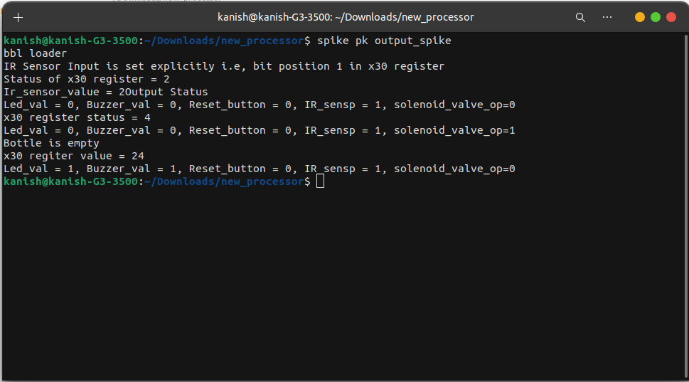

2. When the input is explicitly set to zero i.,e reset button is pressed all the outputs; led, buzzer and solenoid_Valve is set to zero which is shown below:
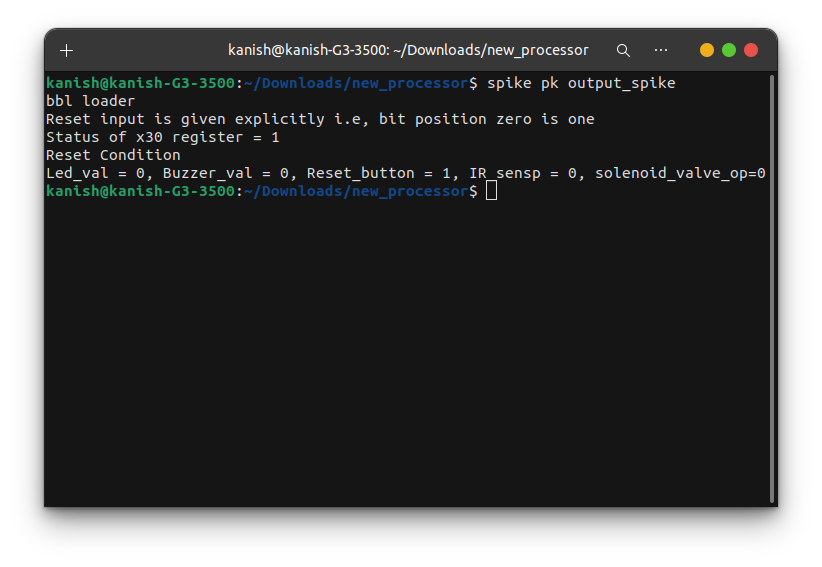

3. When the input ir sensor signal is not received then all the output are zero which is shown below:
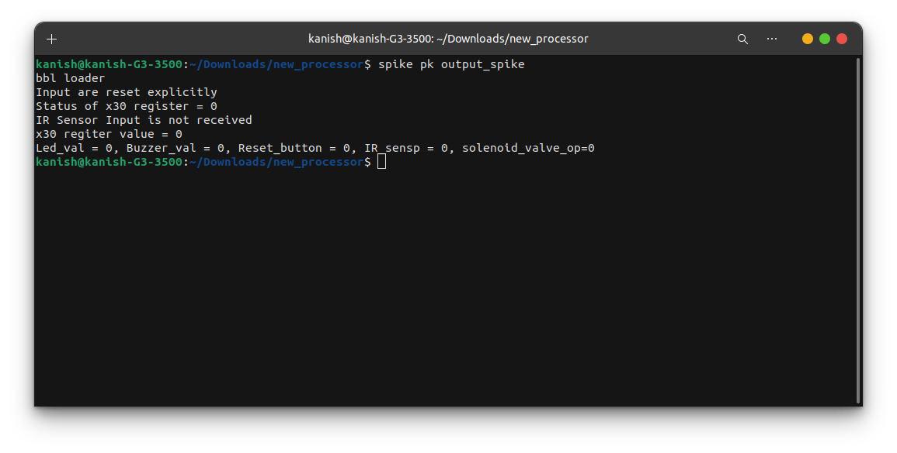

## Functional Simulation In GTKWave
As explained in spike simulation, functional simulation is done in GTKWave and it's output waveform is shown below:

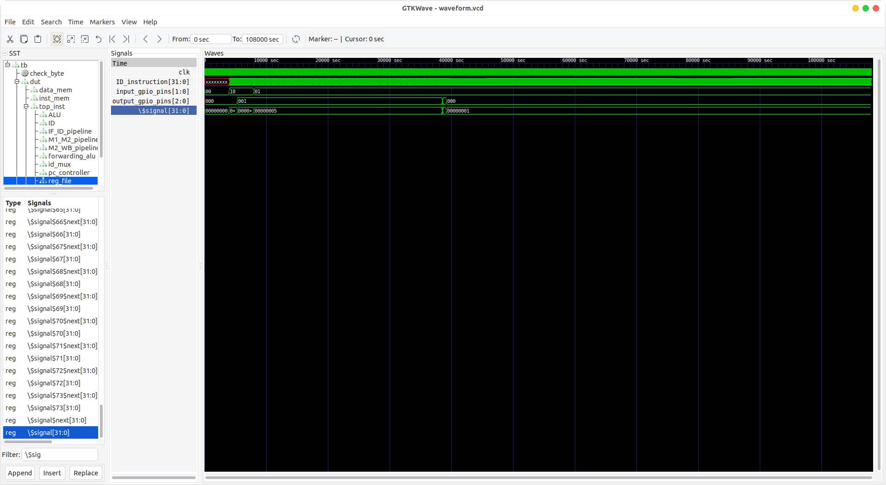


The instruction 00ff6f33 corresponds to or	t5,t5,a5. The previous value of t5 is 0 which is ored with value of a5 to assert the output.
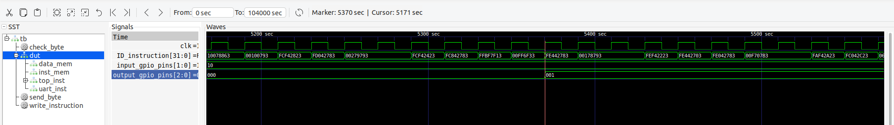

The instruction fe3f7f13 corresponds to	andi t5,t5,-29 which clears the output bits t5 register i.e, x30 to change the value of the output.
The next three instructions 00ff6f33, 00ef6f33 and 00df6f33 corresponds to 	or	t5,t5,a5,  or	t5,t5,a4, or	t5,t5,a3 which or's the new output value to output bits of x30 register.

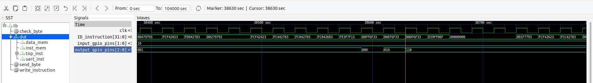

## Instruction Demonstration

1. addi	sp,sp,-96

Stack pointer is \$signal$45 register
the default value of the stack pointer is ff and it is getting decrease by 96 which is 9F
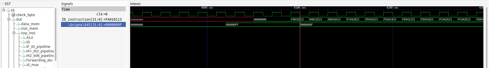

2. slli	a5,a5,0x2

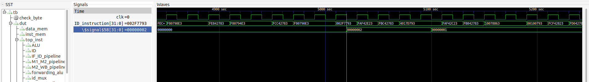

3. andi	t5,t5,-29


4. or t5,t5,a5
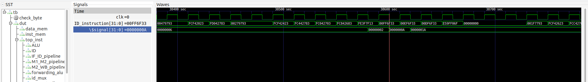

t5 is a temporary register corresponding to x30 register. In the core, it is \$signal.

5. beqz a5,10128 <main+0xd4>
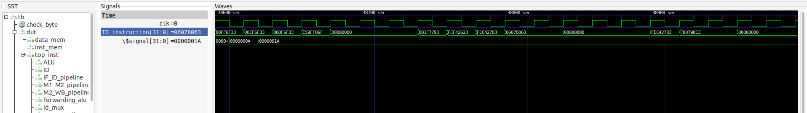

## Unique Instructions
```
Number of different instructions: 17
List of unique instructions:
bnez
or
srai
add
beqz
andi
sw
bge
bne
slli
sub
mv
j
lui
addi
li
lw
```

## Gate Level Simulation
GLS is generating the simulation output by running test bench with netlist file generated from synthesis as design under test. Netlist is logically same as RTL code, therefore, same test bench can be used for it.We perform this to verify logical correctness of the design after synthesizing it. Also ensuring the timing of the design is met. Folllowing are the commands to we need to convert Rtl code to netlist in yosys for that commands are :

For simulation purpose in the processor assert the writing_inst_done = 1; 
```
read_liberty -lib sky130_fd_sc_hd__tt_025C_1v80_256.lib 
read_verilog processor_gls.v # Change to processor_asic
synth -top wrapper
dfflibmap -liberty sky130_fd_sc_hd__tt_025C_1v80_256.lib 
abc -liberty sky130_fd_sc_hd__tt_025C_1v80_256.lib
write_verilog synth_processor_test.v
```

Folllowing are the commands to run the GLS simulation:

```
iverilog -o test synth_processor_test.v testbench.v sky130_sram_1kbyte_1rw1r_32x256_8.v sky130_fd_sc_hd.v primitives.v
```
Synthesized files [Synthesized Verilog Files](./Verilog_Files)

## GLS Outputs
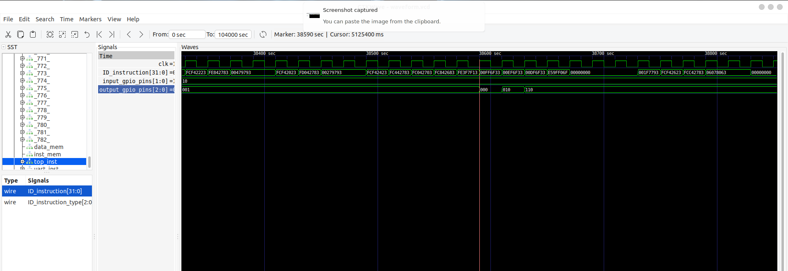

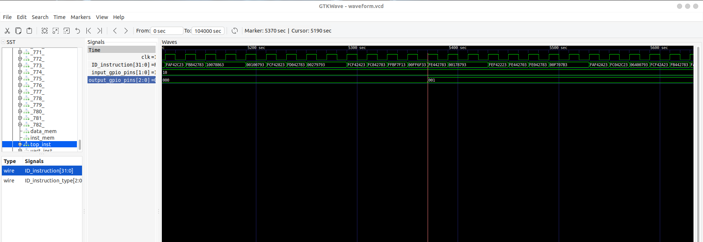

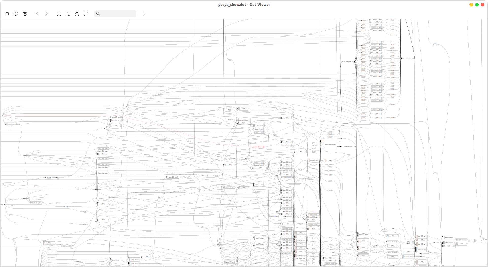

## OpenLane Flow
OpenLane is an automated RTL to GDSII flow based on several components including OpenROAD, Yosys, Magic, Netgen, CVC, SPEF-Extractor, CU-GR, Klayout and a number of custom scripts for design exploration and optimization. The flow performs full ASIC implementation steps from RTL all the way down to GDSII.

To know more about Openlane  : https://github.com/The-OpenROAD-Project/OpenLane
### Resolving the MAX_TRANSITION_TIME Issue
Use the command below to resolve the max transition time error:
```
sed -i's/max_transition   :0.04/max_transition   :0.75'*/*.lib
```
To begin the openlane flow, the verilog design file and corresponding configuration must be imported in the openlane. To do that follow the commands given below:
```
make mount
./flow.tcl -interactive
package require openlane 0.9
prep -design kanish 
```


Once the design is imported then design file has to be synthesized.To synthesize the code run the following command
```
run_synthesis
```


The synthesis results are shown below:

**Area Report**

```
74. Printing statistics.

=== wrapper ===

   Number of wires:              16713
   Number of wire bits:          16725
   Number of public wires:       16713
   Number of public wire bits:   16725
   Number of memories:               0
   Number of memory bits:            0
   Number of processes:              0
   Number of cells:              16593
     sky130_fd_sc_hd__a2111o_2       5
     sky130_fd_sc_hd__a211o_2        9
     sky130_fd_sc_hd__a211oi_2       2
     sky130_fd_sc_hd__a211oi_4       1
     sky130_fd_sc_hd__a21bo_2        5
     sky130_fd_sc_hd__a21bo_4        1
     sky130_fd_sc_hd__a21boi_2       3
     sky130_fd_sc_hd__a21boi_4       1
     sky130_fd_sc_hd__a21o_2       105
     sky130_fd_sc_hd__a21o_4         1
     sky130_fd_sc_hd__a21oi_2      494
     sky130_fd_sc_hd__a21oi_4      571
     sky130_fd_sc_hd__a221o_2        1
     sky130_fd_sc_hd__a221oi_2       1
     sky130_fd_sc_hd__a22o_2       371
     sky130_fd_sc_hd__a2bb2o_4       1
     sky130_fd_sc_hd__a31o_2        24
     sky130_fd_sc_hd__a31o_4         1
     sky130_fd_sc_hd__a31oi_2        7
     sky130_fd_sc_hd__a31oi_4        3
     sky130_fd_sc_hd__a41o_2         2
     sky130_fd_sc_hd__and2_2        69
     sky130_fd_sc_hd__and2_4        21
     sky130_fd_sc_hd__and2b_2       41
     sky130_fd_sc_hd__and3_2       212
     sky130_fd_sc_hd__and3_4         1
     sky130_fd_sc_hd__and4_2         3
     sky130_fd_sc_hd__and4b_2        3
     sky130_fd_sc_hd__buf_1        353
     sky130_fd_sc_hd__buf_12         9
     sky130_fd_sc_hd__buf_2        714
     sky130_fd_sc_hd__buf_4        163
     sky130_fd_sc_hd__buf_6        141
     sky130_fd_sc_hd__buf_8          6
     sky130_fd_sc_hd__bufinv_8       3
     sky130_fd_sc_hd__conb_1        37
     sky130_fd_sc_hd__dfxtp_2     1281
     sky130_fd_sc_hd__inv_2       2253
     sky130_fd_sc_hd__inv_4         12
     sky130_fd_sc_hd__inv_6          5
     sky130_fd_sc_hd__inv_8          5
     sky130_fd_sc_hd__mux2_1        13
     sky130_fd_sc_hd__mux2_2       316
     sky130_fd_sc_hd__nand2_2     5196
     sky130_fd_sc_hd__nand2_4      109
     sky130_fd_sc_hd__nand2_8        3
     sky130_fd_sc_hd__nand2b_2       6
     sky130_fd_sc_hd__nand2b_4       1
     sky130_fd_sc_hd__nand3_2      664
     sky130_fd_sc_hd__nand3_4        7
     sky130_fd_sc_hd__nand3b_2      70
     sky130_fd_sc_hd__nor2_2       977
     sky130_fd_sc_hd__nor2_4        73
     sky130_fd_sc_hd__nor2_8        54
     sky130_fd_sc_hd__nor2b_2        6
     sky130_fd_sc_hd__nor2b_4        1
     sky130_fd_sc_hd__nor3_2        68
     sky130_fd_sc_hd__nor3_4         5
     sky130_fd_sc_hd__nor3b_2        1
     sky130_fd_sc_hd__o2111ai_2      1
     sky130_fd_sc_hd__o211a_2       82
     sky130_fd_sc_hd__o211a_4       24
     sky130_fd_sc_hd__o211ai_2      41
     sky130_fd_sc_hd__o21a_2       111
     sky130_fd_sc_hd__o21a_4        33
     sky130_fd_sc_hd__o21ai_2      507
     sky130_fd_sc_hd__o21ai_4        2
     sky130_fd_sc_hd__o21bai_2      11
     sky130_fd_sc_hd__o21bai_4       2
     sky130_fd_sc_hd__o221a_2       14
     sky130_fd_sc_hd__o221ai_2       9
     sky130_fd_sc_hd__o22a_2        73
     sky130_fd_sc_hd__o22ai_2      839
     sky130_fd_sc_hd__o22ai_4        1
     sky130_fd_sc_hd__o2bb2a_2       2
     sky130_fd_sc_hd__o2bb2ai_2      1
     sky130_fd_sc_hd__o311a_2        4
     sky130_fd_sc_hd__o31a_2        28
     sky130_fd_sc_hd__o31ai_2        2
     sky130_fd_sc_hd__o32a_2         2
     sky130_fd_sc_hd__or2_2        163
     sky130_fd_sc_hd__or2_4         23
     sky130_fd_sc_hd__or2b_2        30
     sky130_fd_sc_hd__or3_2         14
     sky130_fd_sc_hd__or3_4         10
     sky130_fd_sc_hd__or3b_2         3
     sky130_fd_sc_hd__or3b_4         2
     sky130_fd_sc_hd__or4_2          5
     sky130_fd_sc_hd__or4_4          3
     sky130_fd_sc_hd__or4b_2         1
     sky130_fd_sc_hd__or4b_4         1
     sky130_fd_sc_hd__xnor2_2        9
     sky130_fd_sc_hd__xor2_2        26
     sky130_fd_sc_hd__xor2_4         1
     sky130_sram_1kbyte_1rw1r_32x256_8      2

   Chip area for module '\wrapper': 523480.092000
```

After Synthesis, floorplanning has to be done. To perform floorplan run the following command
```
run_floorplan
```


Post the floorplan run, a .def file will have been created within the results/floorplan directory. To view the floorplan: Magic is invoked after moving to the results/floorplan directory,then use the following command:
```
magic -T /home/parallels/.volare/volare/sky130/versions/1341f54f5ce0c4955326297f235e4ace1eb6d419/sky130A/libs.tech/magic/sky130A.tech lef read ../../tmp/merged.nom.lef def read wrapper.def &
```

The floor plan result is shown below:


**Die and Core Area Post Floorplan**

```
Core Area - 5.52 10.88 1149.08 1153.28
Die Area - 0.0 0.0 1155.025 1165.745
```

Once floorplan is done the standard cells has to be placed in the appropriate position. This step is called placement. To perform placement type the following command:
```
run_placement
```


Post placement: the design can be viewed on magic within results/placement directory. Run the follwing command in that directory:

```
magic -T /home/parallels/.volare/volare/sky130/versions/1341f54f5ce0c4955326297f235e4ace1eb6d419/sky130A/libs.tech/magic/sky130A.tech lef read ../../tmp/merged.nom.lef def read wrapper.def &
```


Once the cells are placed clock buffers has to be inserted and clock tree has to be constructed. To perform this type the following command:
```
run_cts
```


## Timing and Power Reports
```
===========================================================================
 report_power
============================================================================
======================= Typical Corner ===================================

Group                  Internal  Switching    Leakage      Total
                          Power      Power      Power      Power (Watts)
----------------------------------------------------------------
Sequential             9.00e-04   2.67e-05   1.08e-08   9.27e-04  27.8%
Combinational          1.65e-03   7.20e-04   3.81e-05   2.41e-03  72.2%
Macro                  0.00e+00   0.00e+00   0.00e+00   0.00e+00   0.0%
Pad                    0.00e+00   0.00e+00   0.00e+00   0.00e+00   0.0%
----------------------------------------------------------------
Total                  2.55e-03   7.47e-04   3.81e-05   3.33e-03 100.0%
                          76.5%      22.4%       1.1%

power_report_end
summary_report

===========================================================================
report_tns
============================================================================
tns 0.00

===========================================================================
report_wns
============================================================================
wns 0.00

===========================================================================
report_worst_slack -max (Setup)
============================================================================
worst slack 15.97

===========================================================================
report_worst_slack -min (Hold)
============================================================================
worst slack 0.15
summary_report_end
area_report

===========================================================================
report_design_area
============================================================================
Design area 513827 u^2 39% utilization.
```

Once CTS is over power distribution network has to be constructed to supply voltage to all the cells. To perform this use the following command
```
gen_pdn
```


## Word of thanks
I sciencerly thank Mr. Kunal Gosh(Founder/VSD) for helping me out to complete this flow smoothly.

## Acknowledgement
1. Kunal Ghosh, VSD Corp. Pvt. Ltd.
2. Skywater Foundry
3. Alwin Shaju,Colleague,IIIT B
4. Mayank Kabra

## Reference
1. https://github.com/SakethGajawada/RISCV-GNU
2. https://how2electronics.com/arduino-water-flow-sensor-measure-flow-rate-volume/
