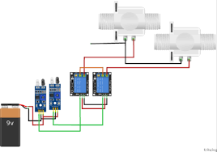
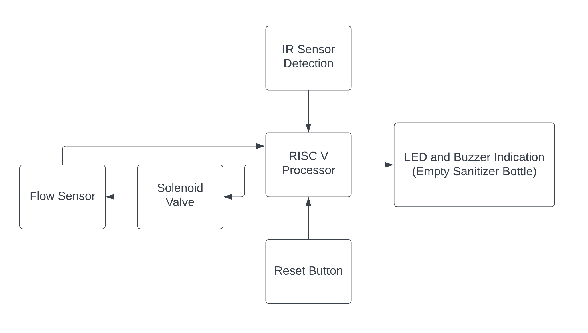
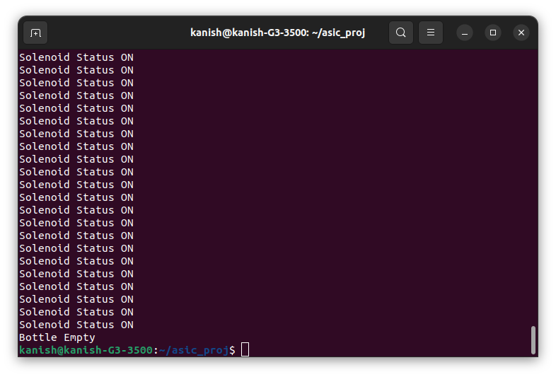

# RISCV_Automatic-Sanitizer-Dispenser
This github repository summarizes the progress made in the ASIC class for the riscv_project.

## Aim
The project's goal is to design an automatic sanitizer dispenser utilizing a specialized RISCV processor for bottle refill alerts and touch-free sanitizer distribution, with the objective of minimizing the machine's footprint, energy consumption, and overall expenses.

## Working
An infrared sensor is employed to detect the presence of a hand. Upon hand detection, the solenoid valve is activated. The sanitizer is directed through the flow sensor via the open solenoid valve, allowing the flow sensor to calculate the quantity of sanitizer dispensed. The system is configured to accommodate a sanitizer bottle with a capacity of half a liter. Upon detecting the dispensing of half a liter, the flow sensor triggers a buzzer, signaling the need for a sanitizer bottle refill.

## Circuit
This is not the depiction of the final circuit. <br>


## Block Diagram


## C Code
```
void read();
void operate(int);
void bottle_status();
int __divsi3(int , int );
double __floatsidf(int );
double __divdf3(double , double );
int __fixdfsi(double );
double __muldf3(double , double);

int ir_sen_ip;
int solenoid_valve_op = 0;
int flow_sensor_ip;
int led_op = 0;
int buzzer = 0;
int counter_h = 0;
int counter_l = 0;
int reset_button = 0;
int water_used=0;


int main()
{ 
    int solenoid_reg, led_reg, buzzer_reg;
    solenoid_reg = solenoid_valve_op*4;
    led_reg = led_op*8;
    buzzer_reg = buzzer*16;
    asm volatile(
	"or x30, x30, %0\n\t"
	"or x30, x30, %1\n\t"
	"or x30, x30, %2\n\t" 
	:
	:"r"(solenoid_reg),"r"(led_reg),"r"(buzzer_reg)
	:"x30"
	);
		
    while(1){
    //reset = digital_read(0);
    	asm volatile(
	"andi %0, x30, 1\n\t"
	:"=r"(reset_button)
	:
	:
	);
    if(reset_button)
    {
        solenoid_valve_op = 0;
        led_op = 0;
        buzzer = 0;
        counter_h = 0;
        counter_l = 0;
        water_used = 0;
        //digital_write(4,solenoid_valve_op);
        //digital_write(5,led_op);
        //digital_write(6,buzzer);
        solenoid_reg = solenoid_valve_op*4;
        led_reg = led_op*8;
        buzzer_reg = buzzer*16;
        asm volatile(
	"or x30, x30,%0 \n\t"
	"or x30, x30,%1 \n\t"
	"or x30, x30,%2 \n\t" 
	:
	:"r"(solenoid_reg),"r"(led_reg),"r"(buzzer_reg)
	:"x30"
	);
    }
    else
    {
    while(!led_op && !buzzer && !reset_button){
        read();

    }
    }
    }
    return 0;
}

// Implementation for __muldf3
double __muldf3(double a, double b) {
    // Your implementation here
    return a * b;
}


void read()
{
   int ir_sen_ip_reg;
    //ir_sen_ip = digital_read(1);
    asm volatile(
	"andi %0, x30, 2\n\t"
	:"=r"(ir_sen_ip_reg)
	:
	:
	);
    ir_sen_ip = ir_sen_ip_reg>>1;
    operate(ir_sen_ip);
}

void operate(int ir_value)
{
    int solenoid_reg;
    if(ir_value)
    {
    	
        solenoid_valve_op = 1;
        solenoid_reg = solenoid_valve_op*4;
        asm volatile(
	"or x30, x30,%0 \n\t"
	:
	:"r"(solenoid_reg)
	:"x30"
	);
        //digital_write(4,solenoid_valve_op);
        counter_h++;
        bottle_status();
        

    }
    else {
        solenoid_valve_op = 0;
        //digital_write(4,solenoid_valve_op);
        solenoid_reg = solenoid_valve_op*4;
        asm volatile(
	"or x30, x30,%0 \n\t"
	:
	:"r"(solenoid_reg)
	:"x30"
	);
        counter_l++;
    }

}

// Implementations for missing functions
int __divsi3(int a, int b) {
    // Your implementation here
    return a / b;
}

double __floatsidf(int a) {
    // Your implementation here
    return (double)a;
}

double __divdf3(double a, double b) {
    // Your implementation here
    return a / b;
}

int __fixdfsi(double a) {
    // Your implementation here
    return (int)a;
}


void bottle_status()
{
    int time = counter_h + counter_l;
    int freq = 1000000>>time;
    int water = freq*0.13;
    int ls = water * 16.67;
    int led_reg;
    int buzzer_reg;
    water_used = water_used+ls;
    if(ls==500)
    {
        led_op = 1;
        buzzer = 1;   
        //digital_write(5,led_op);
        //digital_write(6,buzzer);
        led_reg = led_op*8;
        buzzer_reg = buzzer*16;
        
        asm volatile(
	"or x30, x30, %0\n\t"
	"or x30, x30, %1\n\t" 
	:
	:"r"(led_reg),	"r"(buzzer_reg)
	:"x30"
	);
        
        
    }
}

```
## GCC Compiler Working

## Assembly code conversion

Compile the c program using RISCV-V GNU Toolchain and dump the assembly code into water_level_assembly.txt using the below commands.

```
riscv32-unkown-elf-gcc -march=rv32i -mabi=ilp32 -ffreestanding  -nostdlib -o ./out22 san_disp.c
riscv32-unknown-elf-objdump -d  -r out > assembly.txt
```

## Assembly Code
```

out22:     file format elf32-littleriscv


Disassembly of section .text:

00010094 <main>:
   10094:	fe010113          	add	sp,sp,-32
   10098:	00112e23          	sw	ra,28(sp)
   1009c:	00812c23          	sw	s0,24(sp)
   100a0:	02010413          	add	s0,sp,32
   100a4:	000117b7          	lui	a5,0x11
   100a8:	4ec7a783          	lw	a5,1260(a5) # 114ec <solenoid_valve_op>
   100ac:	00279793          	sll	a5,a5,0x2
   100b0:	fef42623          	sw	a5,-20(s0)
   100b4:	80c1a783          	lw	a5,-2036(gp) # 114f4 <led_op>
   100b8:	00379793          	sll	a5,a5,0x3
   100bc:	fef42423          	sw	a5,-24(s0)
   100c0:	8101a783          	lw	a5,-2032(gp) # 114f8 <buzzer>
   100c4:	00479793          	sll	a5,a5,0x4
   100c8:	fef42223          	sw	a5,-28(s0)
   100cc:	fec42783          	lw	a5,-20(s0)
   100d0:	fe842703          	lw	a4,-24(s0)
   100d4:	fe442683          	lw	a3,-28(s0)
   100d8:	00ff6f33          	or	t5,t5,a5
   100dc:	00ef6f33          	or	t5,t5,a4
   100e0:	00df6f33          	or	t5,t5,a3
   100e4:	001f7713          	and	a4,t5,1
   100e8:	80e1ae23          	sw	a4,-2020(gp) # 11504 <reset_button>
   100ec:	81c1a783          	lw	a5,-2020(gp) # 11504 <reset_button>
   100f0:	06078463          	beqz	a5,10158 <main+0xc4>
   100f4:	000117b7          	lui	a5,0x11
   100f8:	4e07a623          	sw	zero,1260(a5) # 114ec <solenoid_valve_op>
   100fc:	8001a623          	sw	zero,-2036(gp) # 114f4 <led_op>
   10100:	8001a823          	sw	zero,-2032(gp) # 114f8 <buzzer>
   10104:	8001aa23          	sw	zero,-2028(gp) # 114fc <counter_h>
   10108:	8001ac23          	sw	zero,-2024(gp) # 11500 <counter_l>
   1010c:	8201a023          	sw	zero,-2016(gp) # 11508 <water_used>
   10110:	000117b7          	lui	a5,0x11
   10114:	4ec7a783          	lw	a5,1260(a5) # 114ec <solenoid_valve_op>
   10118:	00279793          	sll	a5,a5,0x2
   1011c:	fef42623          	sw	a5,-20(s0)
   10120:	80c1a783          	lw	a5,-2036(gp) # 114f4 <led_op>
   10124:	00379793          	sll	a5,a5,0x3
   10128:	fef42423          	sw	a5,-24(s0)
   1012c:	8101a783          	lw	a5,-2032(gp) # 114f8 <buzzer>
   10130:	00479793          	sll	a5,a5,0x4
   10134:	fef42223          	sw	a5,-28(s0)
   10138:	fec42783          	lw	a5,-20(s0)
   1013c:	fe842703          	lw	a4,-24(s0)
   10140:	fe442683          	lw	a3,-28(s0)
   10144:	00ff6f33          	or	t5,t5,a5
   10148:	00ef6f33          	or	t5,t5,a4
   1014c:	00df6f33          	or	t5,t5,a3
   10150:	f95ff06f          	j	100e4 <main+0x50>
   10154:	074000ef          	jal	101c8 <read>
   10158:	80c1a783          	lw	a5,-2036(gp) # 114f4 <led_op>
   1015c:	f80794e3          	bnez	a5,100e4 <main+0x50>
   10160:	8101a783          	lw	a5,-2032(gp) # 114f8 <buzzer>
   10164:	f80790e3          	bnez	a5,100e4 <main+0x50>
   10168:	81c1a783          	lw	a5,-2020(gp) # 11504 <reset_button>
   1016c:	fe0784e3          	beqz	a5,10154 <main+0xc0>
   10170:	f75ff06f          	j	100e4 <main+0x50>

00010174 <__muldf3>:
   10174:	fe010113          	add	sp,sp,-32
   10178:	00112e23          	sw	ra,28(sp)
   1017c:	00812c23          	sw	s0,24(sp)
   10180:	02010413          	add	s0,sp,32
   10184:	fea42423          	sw	a0,-24(s0)
   10188:	feb42623          	sw	a1,-20(s0)
   1018c:	fec42023          	sw	a2,-32(s0)
   10190:	fed42223          	sw	a3,-28(s0)
   10194:	fe042603          	lw	a2,-32(s0)
   10198:	fe442683          	lw	a3,-28(s0)
   1019c:	fe842503          	lw	a0,-24(s0)
   101a0:	fec42583          	lw	a1,-20(s0)
   101a4:	fd1ff0ef          	jal	10174 <__muldf3>
   101a8:	00050713          	mv	a4,a0
   101ac:	00058793          	mv	a5,a1
   101b0:	00070513          	mv	a0,a4
   101b4:	00078593          	mv	a1,a5
   101b8:	01c12083          	lw	ra,28(sp)
   101bc:	01812403          	lw	s0,24(sp)
   101c0:	02010113          	add	sp,sp,32
   101c4:	00008067          	ret

000101c8 <read>:
   101c8:	fe010113          	add	sp,sp,-32
   101cc:	00112e23          	sw	ra,28(sp)
   101d0:	00812c23          	sw	s0,24(sp)
   101d4:	02010413          	add	s0,sp,32
   101d8:	002f7793          	and	a5,t5,2
   101dc:	fef42623          	sw	a5,-20(s0)
   101e0:	fec42783          	lw	a5,-20(s0)
   101e4:	4017d713          	sra	a4,a5,0x1
   101e8:	000117b7          	lui	a5,0x11
   101ec:	4ee7a423          	sw	a4,1256(a5) # 114e8 <ir_sen_ip>
   101f0:	000117b7          	lui	a5,0x11
   101f4:	4e87a783          	lw	a5,1256(a5) # 114e8 <ir_sen_ip>
   101f8:	00078513          	mv	a0,a5
   101fc:	018000ef          	jal	10214 <operate>
   10200:	00000013          	nop
   10204:	01c12083          	lw	ra,28(sp)
   10208:	01812403          	lw	s0,24(sp)
   1020c:	02010113          	add	sp,sp,32
   10210:	00008067          	ret

00010214 <operate>:
   10214:	fd010113          	add	sp,sp,-48
   10218:	02112623          	sw	ra,44(sp)
   1021c:	02812423          	sw	s0,40(sp)
   10220:	03010413          	add	s0,sp,48
   10224:	fca42e23          	sw	a0,-36(s0)
   10228:	fdc42783          	lw	a5,-36(s0)
   1022c:	02078e63          	beqz	a5,10268 <operate+0x54>
   10230:	000117b7          	lui	a5,0x11
   10234:	00100713          	li	a4,1
   10238:	4ee7a623          	sw	a4,1260(a5) # 114ec <solenoid_valve_op>
   1023c:	000117b7          	lui	a5,0x11
   10240:	4ec7a783          	lw	a5,1260(a5) # 114ec <solenoid_valve_op>
   10244:	00279793          	sll	a5,a5,0x2
   10248:	fef42623          	sw	a5,-20(s0)
   1024c:	fec42783          	lw	a5,-20(s0)
   10250:	00ff6f33          	or	t5,t5,a5
   10254:	8141a783          	lw	a5,-2028(gp) # 114fc <counter_h>
   10258:	00178713          	add	a4,a5,1
   1025c:	80e1aa23          	sw	a4,-2028(gp) # 114fc <counter_h>
   10260:	150000ef          	jal	103b0 <bottle_status>
   10264:	0300006f          	j	10294 <operate+0x80>
   10268:	000117b7          	lui	a5,0x11
   1026c:	4e07a623          	sw	zero,1260(a5) # 114ec <solenoid_valve_op>
   10270:	000117b7          	lui	a5,0x11
   10274:	4ec7a783          	lw	a5,1260(a5) # 114ec <solenoid_valve_op>
   10278:	00279793          	sll	a5,a5,0x2
   1027c:	fef42623          	sw	a5,-20(s0)
   10280:	fec42783          	lw	a5,-20(s0)
   10284:	00ff6f33          	or	t5,t5,a5
   10288:	8181a783          	lw	a5,-2024(gp) # 11500 <counter_l>
   1028c:	00178713          	add	a4,a5,1
   10290:	80e1ac23          	sw	a4,-2024(gp) # 11500 <counter_l>
   10294:	00000013          	nop
   10298:	02c12083          	lw	ra,44(sp)
   1029c:	02812403          	lw	s0,40(sp)
   102a0:	03010113          	add	sp,sp,48
   102a4:	00008067          	ret

000102a8 <__divsi3>:
   102a8:	fe010113          	add	sp,sp,-32
   102ac:	00112e23          	sw	ra,28(sp)
   102b0:	00812c23          	sw	s0,24(sp)
   102b4:	02010413          	add	s0,sp,32
   102b8:	fea42623          	sw	a0,-20(s0)
   102bc:	feb42423          	sw	a1,-24(s0)
   102c0:	fe842583          	lw	a1,-24(s0)
   102c4:	fec42503          	lw	a0,-20(s0)
   102c8:	fe1ff0ef          	jal	102a8 <__divsi3>
   102cc:	00050793          	mv	a5,a0
   102d0:	00078513          	mv	a0,a5
   102d4:	01c12083          	lw	ra,28(sp)
   102d8:	01812403          	lw	s0,24(sp)
   102dc:	02010113          	add	sp,sp,32
   102e0:	00008067          	ret

000102e4 <__floatsidf>:
   102e4:	fe010113          	add	sp,sp,-32
   102e8:	00112e23          	sw	ra,28(sp)
   102ec:	00812c23          	sw	s0,24(sp)
   102f0:	02010413          	add	s0,sp,32
   102f4:	fea42623          	sw	a0,-20(s0)
   102f8:	fec42503          	lw	a0,-20(s0)
   102fc:	fe9ff0ef          	jal	102e4 <__floatsidf>
   10300:	00050713          	mv	a4,a0
   10304:	00058793          	mv	a5,a1
   10308:	00070513          	mv	a0,a4
   1030c:	00078593          	mv	a1,a5
   10310:	01c12083          	lw	ra,28(sp)
   10314:	01812403          	lw	s0,24(sp)
   10318:	02010113          	add	sp,sp,32
   1031c:	00008067          	ret

00010320 <__divdf3>:
   10320:	fe010113          	add	sp,sp,-32
   10324:	00112e23          	sw	ra,28(sp)
   10328:	00812c23          	sw	s0,24(sp)
   1032c:	02010413          	add	s0,sp,32
   10330:	fea42423          	sw	a0,-24(s0)
   10334:	feb42623          	sw	a1,-20(s0)
   10338:	fec42023          	sw	a2,-32(s0)
   1033c:	fed42223          	sw	a3,-28(s0)
   10340:	fe042603          	lw	a2,-32(s0)
   10344:	fe442683          	lw	a3,-28(s0)
   10348:	fe842503          	lw	a0,-24(s0)
   1034c:	fec42583          	lw	a1,-20(s0)
   10350:	fd1ff0ef          	jal	10320 <__divdf3>
   10354:	00050713          	mv	a4,a0
   10358:	00058793          	mv	a5,a1
   1035c:	00070513          	mv	a0,a4
   10360:	00078593          	mv	a1,a5
   10364:	01c12083          	lw	ra,28(sp)
   10368:	01812403          	lw	s0,24(sp)
   1036c:	02010113          	add	sp,sp,32
   10370:	00008067          	ret

00010374 <__fixdfsi>:
   10374:	fe010113          	add	sp,sp,-32
   10378:	00112e23          	sw	ra,28(sp)
   1037c:	00812c23          	sw	s0,24(sp)
   10380:	02010413          	add	s0,sp,32
   10384:	fea42423          	sw	a0,-24(s0)
   10388:	feb42623          	sw	a1,-20(s0)
   1038c:	fe842503          	lw	a0,-24(s0)
   10390:	fec42583          	lw	a1,-20(s0)
   10394:	fe1ff0ef          	jal	10374 <__fixdfsi>
   10398:	00050793          	mv	a5,a0
   1039c:	00078513          	mv	a0,a5
   103a0:	01c12083          	lw	ra,28(sp)
   103a4:	01812403          	lw	s0,24(sp)
   103a8:	02010113          	add	sp,sp,32
   103ac:	00008067          	ret

000103b0 <bottle_status>:
   103b0:	fd010113          	add	sp,sp,-48
   103b4:	02112623          	sw	ra,44(sp)
   103b8:	02812423          	sw	s0,40(sp)
   103bc:	03010413          	add	s0,sp,48
   103c0:	8141a703          	lw	a4,-2028(gp) # 114fc <counter_h>
   103c4:	8181a783          	lw	a5,-2024(gp) # 11500 <counter_l>
   103c8:	00f707b3          	add	a5,a4,a5
   103cc:	fef42623          	sw	a5,-20(s0)
   103d0:	fec42783          	lw	a5,-20(s0)
   103d4:	000f4737          	lui	a4,0xf4
   103d8:	24070713          	add	a4,a4,576 # f4240 <__global_pointer$+0xe2558>
   103dc:	40f757b3          	sra	a5,a4,a5
   103e0:	fef42423          	sw	a5,-24(s0)
   103e4:	fe842503          	lw	a0,-24(s0)
   103e8:	efdff0ef          	jal	102e4 <__floatsidf>
   103ec:	00050713          	mv	a4,a0
   103f0:	00058793          	mv	a5,a1
   103f4:	000106b7          	lui	a3,0x10
   103f8:	4d86a603          	lw	a2,1240(a3) # 104d8 <bottle_status+0x128>
   103fc:	4dc6a683          	lw	a3,1244(a3)
   10400:	00070513          	mv	a0,a4
   10404:	00078593          	mv	a1,a5
   10408:	d6dff0ef          	jal	10174 <__muldf3>
   1040c:	00050713          	mv	a4,a0
   10410:	00058793          	mv	a5,a1
   10414:	00070513          	mv	a0,a4
   10418:	00078593          	mv	a1,a5
   1041c:	f59ff0ef          	jal	10374 <__fixdfsi>
   10420:	00050793          	mv	a5,a0
   10424:	fef42223          	sw	a5,-28(s0)
   10428:	fe442503          	lw	a0,-28(s0)
   1042c:	eb9ff0ef          	jal	102e4 <__floatsidf>
   10430:	00050713          	mv	a4,a0
   10434:	00058793          	mv	a5,a1
   10438:	000106b7          	lui	a3,0x10
   1043c:	4e06a603          	lw	a2,1248(a3) # 104e0 <bottle_status+0x130>
   10440:	4e46a683          	lw	a3,1252(a3)
   10444:	00070513          	mv	a0,a4
   10448:	00078593          	mv	a1,a5
   1044c:	d29ff0ef          	jal	10174 <__muldf3>
   10450:	00050713          	mv	a4,a0
   10454:	00058793          	mv	a5,a1
   10458:	00070513          	mv	a0,a4
   1045c:	00078593          	mv	a1,a5
   10460:	f15ff0ef          	jal	10374 <__fixdfsi>
   10464:	00050793          	mv	a5,a0
   10468:	fef42023          	sw	a5,-32(s0)
   1046c:	8201a703          	lw	a4,-2016(gp) # 11508 <water_used>
   10470:	fe042783          	lw	a5,-32(s0)
   10474:	00f70733          	add	a4,a4,a5
   10478:	82e1a023          	sw	a4,-2016(gp) # 11508 <water_used>
   1047c:	fe042703          	lw	a4,-32(s0)
   10480:	1f400793          	li	a5,500
   10484:	02f71e63          	bne	a4,a5,104c0 <bottle_status+0x110>
   10488:	00100713          	li	a4,1
   1048c:	80e1a623          	sw	a4,-2036(gp) # 114f4 <led_op>
   10490:	00100713          	li	a4,1
   10494:	80e1a823          	sw	a4,-2032(gp) # 114f8 <buzzer>
   10498:	80c1a783          	lw	a5,-2036(gp) # 114f4 <led_op>
   1049c:	00379793          	sll	a5,a5,0x3
   104a0:	fcf42e23          	sw	a5,-36(s0)
   104a4:	8101a783          	lw	a5,-2032(gp) # 114f8 <buzzer>
   104a8:	00479793          	sll	a5,a5,0x4
   104ac:	fcf42c23          	sw	a5,-40(s0)
   104b0:	fdc42783          	lw	a5,-36(s0)
   104b4:	fd842703          	lw	a4,-40(s0)
   104b8:	00ff6f33          	or	t5,t5,a5
   104bc:	00ef6f33          	or	t5,t5,a4
   104c0:	00000013          	nop
   104c4:	02c12083          	lw	ra,44(sp)
   104c8:	02812403          	lw	s0,40(sp)
   104cc:	03010113          	add	sp,sp,48
   104d0:	00008067          	ret

```

## Unique Instructions
```
Number of different instructions: 17
List of unique instructions:
j
li
jal
bnez
beqz
lw
nop
add
sll
ret
sw
lui
mv
sra
bne
and
or

```
## Word of thanks
I sciencerly thank Mr. Kunal Gosh(Founder/VSD) for helping me out to complete this flow smoothly.

## Acknowledgement
1. Kunal Ghosh, VSD Corp. Pvt. Ltd.
2. Skywater Foundry
3. Alwin Shaju,Colleague,IIIT B
4. Mayank Kabra

## Reference
1. https://github.com/SakethGajawada/RISCV-GNU
2. https://how2electronics.com/arduino-water-flow-sensor-measure-flow-rate-volume/
