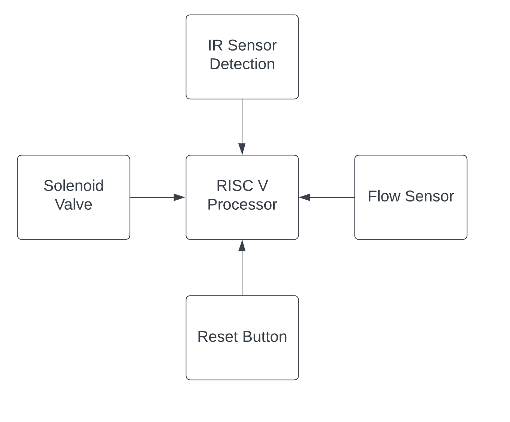

# RISCV_Automatic-Sanitizer-Dispenser
This github repository summarizes the progress made in the ASIC class for the riscv_project.

## Aim
The project's goal is to design an automatic sanitizer dispenser utilizing a specialized RISCV processor for bottle refill alerts and touch-free sanitizer distribution, with the objective of minimizing the machine's footprint, energy consumption, and overall expenses.

## Working
An infrared sensor is employed to detect the presence of a hand. Upon hand detection, the solenoid valve is activated. The sanitizer is directed through the flow sensor via the open solenoid valve, allowing the flow sensor to calculate the quantity of sanitizer dispensed. The system is configured to accommodate a sanitizer bottle with a capacity of half a liter. Upon detecting the dispensing of half a liter, the flow sensor triggers a buzzer, signaling the need for a sanitizer bottle refill.

## Block Diagram


## C Code
```
#include<stdio.h>

void read();
void operate(int);
void bottle_status();

int ir_sen_ip=1;
int solenoid_valve_op = 0;
int flow_sensor_ip;
int led_op = 0;
int buzzer = 0;
int counter_h = 0;
int counter_l = 0;
int reset_button = 0;
float water_used=0;

int main()
{
    while(!led_op && !buzzer && !reset_button){
        read();

    }
    if(reset_button)
    {
        solenoid_valve_op = 0;
        led_op = 0;
        buzzer = 0;
        counter_h = 0;
        counter_l = 0;
        water_used = 0;
    }
    return 0;
}


void read()
{
    operate(ir_sen_ip);
}

void operate(int ir_value)
{
    if(ir_value)
    {
        solenoid_valve_op = 1;
        counter_h++;
        printf("Solenoid Status ON \n");
        bottle_status();
        

    }
    else {
        solenoid_valve_op = 0;
        counter_l++;
    }

}

void bottle_status()
{
    int time = counter_h + counter_l;
    float freq = 1000000/time;
    float water = freq/7.5;
    float ls = water/60;
    water_used = water_used+ls;
    if(ls==0.5)
    {
        led_op = 1;
        buzzer = 1;
        printf("Bottle Empty\n");
    }
}

```

## Assembly Code
```

a.o:     file format elf64-littleriscv


Disassembly of section .text:

00000000000100b0 <register_fini>:
   100b0:	ffff0797          	auipc	a5,0xffff0
   100b4:	f5078793          	addi	a5,a5,-176 # 0 <register_fini-0x100b0>
   100b8:	00078863          	beqz	a5,100c8 <register_fini+0x18>
   100bc:	00001517          	auipc	a0,0x1
   100c0:	c8450513          	addi	a0,a0,-892 # 10d40 <__libc_fini_array>
   100c4:	4350006f          	j	10cf8 <atexit>
   100c8:	00008067          	ret

00000000000100cc <_start>:
   100cc:	00003197          	auipc	gp,0x3
   100d0:	9c418193          	addi	gp,gp,-1596 # 12a90 <__global_pointer$>
   100d4:	f7018513          	addi	a0,gp,-144 # 12a00 <_edata>
   100d8:	fd018613          	addi	a2,gp,-48 # 12a60 <__BSS_END__>
   100dc:	40a60633          	sub	a2,a2,a0
   100e0:	00000593          	li	a1,0
   100e4:	54d000ef          	jal	ra,10e30 <memset>
   100e8:	00001517          	auipc	a0,0x1
   100ec:	c5850513          	addi	a0,a0,-936 # 10d40 <__libc_fini_array>
   100f0:	409000ef          	jal	ra,10cf8 <atexit>
   100f4:	4a9000ef          	jal	ra,10d9c <__libc_init_array>
   100f8:	00012503          	lw	a0,0(sp)
   100fc:	00810593          	addi	a1,sp,8
   10100:	00000613          	li	a2,0
   10104:	160000ef          	jal	ra,10264 <main>
   10108:	4050006f          	j	10d0c <exit>

000000000001010c <__do_global_dtors_aux>:
   1010c:	f901c783          	lbu	a5,-112(gp) # 12a20 <completed.5468>
   10110:	04079463          	bnez	a5,10158 <__do_global_dtors_aux+0x4c>
   10114:	ffff0797          	auipc	a5,0xffff0
   10118:	eec78793          	addi	a5,a5,-276 # 0 <register_fini-0x100b0>
   1011c:	02078863          	beqz	a5,1014c <__do_global_dtors_aux+0x40>
   10120:	ff010113          	addi	sp,sp,-16
   10124:	00002517          	auipc	a0,0x2
   10128:	14c50513          	addi	a0,a0,332 # 12270 <__FRAME_END__>
   1012c:	00113423          	sd	ra,8(sp)
   10130:	00000097          	auipc	ra,0x0
   10134:	000000e7          	jalr	zero # 0 <register_fini-0x100b0>
   10138:	00813083          	ld	ra,8(sp)
   1013c:	00100793          	li	a5,1
   10140:	f8f18823          	sb	a5,-112(gp) # 12a20 <completed.5468>
   10144:	01010113          	addi	sp,sp,16
   10148:	00008067          	ret
   1014c:	00100793          	li	a5,1
   10150:	f8f18823          	sb	a5,-112(gp) # 12a20 <completed.5468>
   10154:	00008067          	ret
   10158:	00008067          	ret

000000000001015c <frame_dummy>:
   1015c:	ffff0797          	auipc	a5,0xffff0
   10160:	ea478793          	addi	a5,a5,-348 # 0 <register_fini-0x100b0>
   10164:	00078c63          	beqz	a5,1017c <frame_dummy+0x20>
   10168:	f9818593          	addi	a1,gp,-104 # 12a28 <object.5473>
   1016c:	00002517          	auipc	a0,0x2
   10170:	10450513          	addi	a0,a0,260 # 12270 <__FRAME_END__>
   10174:	00000317          	auipc	t1,0x0
   10178:	00000067          	jr	zero # 0 <register_fini-0x100b0>
   1017c:	00008067          	ret

0000000000010180 <bottle_status>:
   10180:	fe010113          	addi	sp,sp,-32
   10184:	00113c23          	sd	ra,24(sp)
   10188:	00813823          	sd	s0,16(sp)
   1018c:	00913423          	sd	s1,8(sp)
   10190:	f7c1a583          	lw	a1,-132(gp) # 12a0c <counter_h>
   10194:	f781a783          	lw	a5,-136(gp) # 12a08 <counter_l>
   10198:	00f585bb          	addw	a1,a1,a5
   1019c:	000f4537          	lui	a0,0xf4
   101a0:	24050513          	addi	a0,a0,576 # f4240 <__global_pointer$+0xe17b0>
   101a4:	259000ef          	jal	ra,10bfc <__divdi3>
   101a8:	0005051b          	sext.w	a0,a0
   101ac:	0e9000ef          	jal	ra,10a94 <__floatsisf>
   101b0:	f481a583          	lw	a1,-184(gp) # 129d8 <__SDATA_BEGIN__>
   101b4:	59c000ef          	jal	ra,10750 <__divsf3>
   101b8:	f4c1a583          	lw	a1,-180(gp) # 129dc <__SDATA_BEGIN__+0x4>
   101bc:	594000ef          	jal	ra,10750 <__divsf3>
   101c0:	00050413          	mv	s0,a0
   101c4:	00050593          	mv	a1,a0
   101c8:	f701a503          	lw	a0,-144(gp) # 12a00 <_edata>
   101cc:	12c000ef          	jal	ra,102f8 <__addsf3>
   101d0:	f6a1a823          	sw	a0,-144(gp) # 12a00 <_edata>
   101d4:	f501a583          	lw	a1,-176(gp) # 129e0 <__SDATA_BEGIN__+0x8>
   101d8:	00040513          	mv	a0,s0
   101dc:	03d000ef          	jal	ra,10a18 <__eqsf2>
   101e0:	00051863          	bnez	a0,101f0 <bottle_status+0x70>
   101e4:	00100793          	li	a5,1
   101e8:	f8f1a223          	sw	a5,-124(gp) # 12a14 <led_op>
   101ec:	f8f1a023          	sw	a5,-128(gp) # 12a10 <buzzer>
   101f0:	01813083          	ld	ra,24(sp)
   101f4:	01013403          	ld	s0,16(sp)
   101f8:	00813483          	ld	s1,8(sp)
   101fc:	02010113          	addi	sp,sp,32
   10200:	00008067          	ret

0000000000010204 <operate>:
   10204:	00051c63          	bnez	a0,1021c <operate+0x18>
   10208:	f801a423          	sw	zero,-120(gp) # 12a18 <solenoid_valve_op>
   1020c:	f781a783          	lw	a5,-136(gp) # 12a08 <counter_l>
   10210:	0017879b          	addiw	a5,a5,1
   10214:	f6f1ac23          	sw	a5,-136(gp) # 12a08 <counter_l>
   10218:	00008067          	ret
   1021c:	ff010113          	addi	sp,sp,-16
   10220:	00113423          	sd	ra,8(sp)
   10224:	00100713          	li	a4,1
   10228:	f8e1a423          	sw	a4,-120(gp) # 12a18 <solenoid_valve_op>
   1022c:	f7c1a783          	lw	a5,-132(gp) # 12a0c <counter_h>
   10230:	0017879b          	addiw	a5,a5,1
   10234:	f6f1ae23          	sw	a5,-132(gp) # 12a0c <counter_h>
   10238:	f49ff0ef          	jal	ra,10180 <bottle_status>
   1023c:	00813083          	ld	ra,8(sp)
   10240:	01010113          	addi	sp,sp,16
   10244:	00008067          	ret

0000000000010248 <read>:
   10248:	ff010113          	addi	sp,sp,-16
   1024c:	00113423          	sd	ra,8(sp)
   10250:	fc81a503          	lw	a0,-56(gp) # 12a58 <ir_sen_ip>
   10254:	fb1ff0ef          	jal	ra,10204 <operate>
   10258:	00813083          	ld	ra,8(sp)
   1025c:	01010113          	addi	sp,sp,16
   10260:	00008067          	ret

0000000000010264 <main>:
   10264:	fe010113          	addi	sp,sp,-32
   10268:	00113c23          	sd	ra,24(sp)
   1026c:	00813823          	sd	s0,16(sp)
   10270:	00913423          	sd	s1,8(sp)
   10274:	01213023          	sd	s2,0(sp)
   10278:	f841a783          	lw	a5,-124(gp) # 12a14 <led_op>
   1027c:	f801a703          	lw	a4,-128(gp) # 12a10 <buzzer>
   10280:	00e7e7b3          	or	a5,a5,a4
   10284:	0007879b          	sext.w	a5,a5
   10288:	04079663          	bnez	a5,102d4 <main+0x70>
   1028c:	f741a783          	lw	a5,-140(gp) # 12a04 <reset_button>
   10290:	02079263          	bnez	a5,102b4 <main+0x50>
   10294:	fb5ff0ef          	jal	ra,10248 <read>
   10298:	f841a783          	lw	a5,-124(gp) # 12a14 <led_op>
   1029c:	f801a703          	lw	a4,-128(gp) # 12a10 <buzzer>
   102a0:	00e7e7b3          	or	a5,a5,a4
   102a4:	0007879b          	sext.w	a5,a5
   102a8:	02079663          	bnez	a5,102d4 <main+0x70>
   102ac:	f741a783          	lw	a5,-140(gp) # 12a04 <reset_button>
   102b0:	fe0782e3          	beqz	a5,10294 <main+0x30>
   102b4:	f801a423          	sw	zero,-120(gp) # 12a18 <solenoid_valve_op>
   102b8:	f801a223          	sw	zero,-124(gp) # 12a14 <led_op>
   102bc:	f801a023          	sw	zero,-128(gp) # 12a10 <buzzer>
   102c0:	f601ae23          	sw	zero,-132(gp) # 12a0c <counter_h>
   102c4:	f601ac23          	sw	zero,-136(gp) # 12a08 <counter_l>
   102c8:	00000713          	li	a4,0
   102cc:	f6e1a823          	sw	a4,-144(gp) # 12a00 <_edata>
   102d0:	00c0006f          	j	102dc <main+0x78>
   102d4:	f741a783          	lw	a5,-140(gp) # 12a04 <reset_button>
   102d8:	fc079ee3          	bnez	a5,102b4 <main+0x50>
   102dc:	00000513          	li	a0,0
   102e0:	01813083          	ld	ra,24(sp)
   102e4:	01013403          	ld	s0,16(sp)
   102e8:	00813483          	ld	s1,8(sp)
   102ec:	00013903          	ld	s2,0(sp)
   102f0:	02010113          	addi	sp,sp,32
   102f4:	00008067          	ret

00000000000102f8 <__addsf3>:
   102f8:	00800737          	lui	a4,0x800
   102fc:	fe010113          	addi	sp,sp,-32
   10300:	fff70713          	addi	a4,a4,-1 # 7fffff <__global_pointer$+0x7ed56f>
   10304:	00a777b3          	and	a5,a4,a0
   10308:	00813823          	sd	s0,16(sp)
   1030c:	00b77733          	and	a4,a4,a1
   10310:	0175541b          	srliw	s0,a0,0x17
   10314:	01213023          	sd	s2,0(sp)
   10318:	01f5591b          	srliw	s2,a0,0x1f
   1031c:	0175d51b          	srliw	a0,a1,0x17
   10320:	02079793          	slli	a5,a5,0x20
   10324:	0ff47413          	andi	s0,s0,255
   10328:	02071713          	slli	a4,a4,0x20
   1032c:	0ff57513          	andi	a0,a0,255
   10330:	0207d793          	srli	a5,a5,0x20
   10334:	02075713          	srli	a4,a4,0x20
   10338:	40a406bb          	subw	a3,s0,a0
   1033c:	00113c23          	sd	ra,24(sp)
   10340:	00913423          	sd	s1,8(sp)
   10344:	01f5d59b          	srliw	a1,a1,0x1f
   10348:	00379793          	slli	a5,a5,0x3
   1034c:	00371713          	slli	a4,a4,0x3
   10350:	0006861b          	sext.w	a2,a3
   10354:	18b91463          	bne	s2,a1,104dc <__addsf3+0x1e4>
   10358:	08c05c63          	blez	a2,103f0 <__addsf3+0xf8>
   1035c:	04051c63          	bnez	a0,103b4 <__addsf3+0xbc>
   10360:	34070663          	beqz	a4,106ac <__addsf3+0x3b4>
   10364:	fff6861b          	addiw	a2,a3,-1
   10368:	02061e63          	bnez	a2,103a4 <__addsf3+0xac>
   1036c:	00e787b3          	add	a5,a5,a4
   10370:	00040513          	mv	a0,s0
   10374:	02579713          	slli	a4,a5,0x25
   10378:	10075c63          	bgez	a4,10490 <__addsf3+0x198>
   1037c:	00150513          	addi	a0,a0,1
   10380:	0ff00713          	li	a4,255
   10384:	32e50e63          	beq	a0,a4,106c0 <__addsf3+0x3c8>
   10388:	fc000737          	lui	a4,0xfc000
   1038c:	fff70713          	addi	a4,a4,-1 # fffffffffbffffff <__global_pointer$+0xfffffffffbfed56f>
   10390:	0017f693          	andi	a3,a5,1
   10394:	00f777b3          	and	a5,a4,a5
   10398:	0017d793          	srli	a5,a5,0x1
   1039c:	00d7e7b3          	or	a5,a5,a3
   103a0:	0f00006f          	j	10490 <__addsf3+0x198>
   103a4:	0ff00693          	li	a3,255
   103a8:	00d41e63          	bne	s0,a3,103c4 <__addsf3+0xcc>
   103ac:	0ff00513          	li	a0,255
   103b0:	0e00006f          	j	10490 <__addsf3+0x198>
   103b4:	0ff00693          	li	a3,255
   103b8:	fed40ae3          	beq	s0,a3,103ac <__addsf3+0xb4>
   103bc:	040006b7          	lui	a3,0x4000
   103c0:	00d76733          	or	a4,a4,a3
   103c4:	01b00693          	li	a3,27
   103c8:	00c6d663          	bge	a3,a2,103d4 <__addsf3+0xdc>
   103cc:	00100713          	li	a4,1
   103d0:	f9dff06f          	j	1036c <__addsf3+0x74>
   103d4:	04000693          	li	a3,64
   103d8:	00c755b3          	srl	a1,a4,a2
   103dc:	40c6863b          	subw	a2,a3,a2
   103e0:	00c71733          	sll	a4,a4,a2
   103e4:	00e03733          	snez	a4,a4
   103e8:	00e5e733          	or	a4,a1,a4
   103ec:	f81ff06f          	j	1036c <__addsf3+0x74>
   103f0:	06060663          	beqz	a2,1045c <__addsf3+0x164>
   103f4:	02041463          	bnez	s0,1041c <__addsf3+0x124>
   103f8:	00078e63          	beqz	a5,10414 <__addsf3+0x11c>
   103fc:	fff00593          	li	a1,-1
   10400:	00b61663          	bne	a2,a1,1040c <__addsf3+0x114>
   10404:	00e787b3          	add	a5,a5,a4
   10408:	f6dff06f          	j	10374 <__addsf3+0x7c>
   1040c:	0ff00613          	li	a2,255
   10410:	32c51463          	bne	a0,a2,10738 <__addsf3+0x440>
   10414:	00070793          	mv	a5,a4
   10418:	0780006f          	j	10490 <__addsf3+0x198>
   1041c:	0ff00613          	li	a2,255
   10420:	fec50ae3          	beq	a0,a2,10414 <__addsf3+0x11c>
   10424:	04000637          	lui	a2,0x4000
   10428:	40d006bb          	negw	a3,a3
   1042c:	00c7e7b3          	or	a5,a5,a2
   10430:	01b00613          	li	a2,27
   10434:	00d65663          	bge	a2,a3,10440 <__addsf3+0x148>
   10438:	00100793          	li	a5,1
   1043c:	fc9ff06f          	j	10404 <__addsf3+0x10c>
   10440:	04000613          	li	a2,64
   10444:	00d7d5b3          	srl	a1,a5,a3
   10448:	40d606bb          	subw	a3,a2,a3
   1044c:	00d797b3          	sll	a5,a5,a3
   10450:	00f037b3          	snez	a5,a5
   10454:	00f5e7b3          	or	a5,a1,a5
   10458:	fadff06f          	j	10404 <__addsf3+0x10c>
   1045c:	00140693          	addi	a3,s0,1
   10460:	0fe6f513          	andi	a0,a3,254
   10464:	06051063          	bnez	a0,104c4 <__addsf3+0x1cc>
   10468:	04041263          	bnez	s0,104ac <__addsf3+0x1b4>
   1046c:	fa0784e3          	beqz	a5,10414 <__addsf3+0x11c>
   10470:	02070063          	beqz	a4,10490 <__addsf3+0x198>
   10474:	00e787b3          	add	a5,a5,a4
   10478:	02579713          	slli	a4,a5,0x25
   1047c:	00075a63          	bgez	a4,10490 <__addsf3+0x198>
   10480:	fc000737          	lui	a4,0xfc000
   10484:	fff70713          	addi	a4,a4,-1 # fffffffffbffffff <__global_pointer$+0xfffffffffbfed56f>
   10488:	00e7f7b3          	and	a5,a5,a4
   1048c:	00100513          	li	a0,1
   10490:	0077f713          	andi	a4,a5,7
   10494:	22070863          	beqz	a4,106c4 <__addsf3+0x3cc>
   10498:	00f7f713          	andi	a4,a5,15
   1049c:	00400693          	li	a3,4
   104a0:	22d70263          	beq	a4,a3,106c4 <__addsf3+0x3cc>
   104a4:	00478793          	addi	a5,a5,4
   104a8:	21c0006f          	j	106c4 <__addsf3+0x3cc>
   104ac:	20078463          	beqz	a5,106b4 <__addsf3+0x3bc>
   104b0:	ee070ee3          	beqz	a4,103ac <__addsf3+0xb4>
   104b4:	00000913          	li	s2,0
   104b8:	020007b7          	lui	a5,0x2000
   104bc:	0ff00513          	li	a0,255
   104c0:	2040006f          	j	106c4 <__addsf3+0x3cc>
   104c4:	0ff00613          	li	a2,255
   104c8:	1ec68a63          	beq	a3,a2,106bc <__addsf3+0x3c4>
   104cc:	00e787b3          	add	a5,a5,a4
   104d0:	0017d793          	srli	a5,a5,0x1
   104d4:	00068513          	mv	a0,a3
   104d8:	fb9ff06f          	j	10490 <__addsf3+0x198>
   104dc:	08c05863          	blez	a2,1056c <__addsf3+0x274>
   104e0:	04051863          	bnez	a0,10530 <__addsf3+0x238>
   104e4:	00040513          	mv	a0,s0
   104e8:	fa0704e3          	beqz	a4,10490 <__addsf3+0x198>
   104ec:	fff6861b          	addiw	a2,a3,-1
   104f0:	02061263          	bnez	a2,10514 <__addsf3+0x21c>
   104f4:	40e787b3          	sub	a5,a5,a4
   104f8:	02579713          	slli	a4,a5,0x25
   104fc:	f8075ae3          	bgez	a4,10490 <__addsf3+0x198>
   10500:	040004b7          	lui	s1,0x4000
   10504:	fff48493          	addi	s1,s1,-1 # 3ffffff <__global_pointer$+0x3fed56f>
   10508:	0097f4b3          	and	s1,a5,s1
   1050c:	00050413          	mv	s0,a0
   10510:	13c0006f          	j	1064c <__addsf3+0x354>
   10514:	0ff00693          	li	a3,255
   10518:	0ff00513          	li	a0,255
   1051c:	f6d40ae3          	beq	s0,a3,10490 <__addsf3+0x198>
   10520:	01b00693          	li	a3,27
   10524:	02c6d263          	bge	a3,a2,10548 <__addsf3+0x250>
   10528:	00100713          	li	a4,1
   1052c:	0340006f          	j	10560 <__addsf3+0x268>
   10530:	0ff00693          	li	a3,255
   10534:	0ff00513          	li	a0,255
   10538:	f4d40ce3          	beq	s0,a3,10490 <__addsf3+0x198>
   1053c:	040006b7          	lui	a3,0x4000
   10540:	00d76733          	or	a4,a4,a3
   10544:	fddff06f          	j	10520 <__addsf3+0x228>
   10548:	04000693          	li	a3,64
   1054c:	00c755b3          	srl	a1,a4,a2
   10550:	40c6863b          	subw	a2,a3,a2
   10554:	00c71733          	sll	a4,a4,a2
   10558:	00e03733          	snez	a4,a4
   1055c:	00e5e733          	or	a4,a1,a4
   10560:	40e787b3          	sub	a5,a5,a4
   10564:	00040513          	mv	a0,s0
   10568:	f91ff06f          	j	104f8 <__addsf3+0x200>
   1056c:	06060a63          	beqz	a2,105e0 <__addsf3+0x2e8>
   10570:	02041863          	bnez	s0,105a0 <__addsf3+0x2a8>
   10574:	02078063          	beqz	a5,10594 <__addsf3+0x29c>
   10578:	fff00813          	li	a6,-1
   1057c:	01061863          	bne	a2,a6,1058c <__addsf3+0x294>
   10580:	40f707b3          	sub	a5,a4,a5
   10584:	00058913          	mv	s2,a1
   10588:	f71ff06f          	j	104f8 <__addsf3+0x200>
   1058c:	0ff00613          	li	a2,255
   10590:	1ac51a63          	bne	a0,a2,10744 <__addsf3+0x44c>
   10594:	00070793          	mv	a5,a4
   10598:	00058913          	mv	s2,a1
   1059c:	ef5ff06f          	j	10490 <__addsf3+0x198>
   105a0:	0ff00613          	li	a2,255
   105a4:	fec508e3          	beq	a0,a2,10594 <__addsf3+0x29c>
   105a8:	04000637          	lui	a2,0x4000
   105ac:	40d006bb          	negw	a3,a3
   105b0:	00c7e7b3          	or	a5,a5,a2
   105b4:	01b00613          	li	a2,27
   105b8:	00d65663          	bge	a2,a3,105c4 <__addsf3+0x2cc>
   105bc:	00100793          	li	a5,1
   105c0:	fc1ff06f          	j	10580 <__addsf3+0x288>
   105c4:	04000613          	li	a2,64
   105c8:	00d7d833          	srl	a6,a5,a3
   105cc:	40d606bb          	subw	a3,a2,a3
   105d0:	00d797b3          	sll	a5,a5,a3
   105d4:	00f037b3          	snez	a5,a5
   105d8:	00f867b3          	or	a5,a6,a5
   105dc:	fa5ff06f          	j	10580 <__addsf3+0x288>
   105e0:	00140513          	addi	a0,s0,1
   105e4:	0fe57513          	andi	a0,a0,254
   105e8:	04051863          	bnez	a0,10638 <__addsf3+0x340>
   105ec:	02041c63          	bnez	s0,10624 <__addsf3+0x32c>
   105f0:	00079a63          	bnez	a5,10604 <__addsf3+0x30c>
   105f4:	fa0710e3          	bnez	a4,10594 <__addsf3+0x29c>
   105f8:	00000793          	li	a5,0
   105fc:	00000913          	li	s2,0
   10600:	0c40006f          	j	106c4 <__addsf3+0x3cc>
   10604:	e80706e3          	beqz	a4,10490 <__addsf3+0x198>
   10608:	40e786b3          	sub	a3,a5,a4
   1060c:	02569613          	slli	a2,a3,0x25
   10610:	40f707b3          	sub	a5,a4,a5
   10614:	f80642e3          	bltz	a2,10598 <__addsf3+0x2a0>
   10618:	fe0680e3          	beqz	a3,105f8 <__addsf3+0x300>
   1061c:	00068793          	mv	a5,a3
   10620:	e71ff06f          	j	10490 <__addsf3+0x198>
   10624:	e80796e3          	bnez	a5,104b0 <__addsf3+0x1b8>
   10628:	e80706e3          	beqz	a4,104b4 <__addsf3+0x1bc>
   1062c:	00070793          	mv	a5,a4
   10630:	00058913          	mv	s2,a1
   10634:	d79ff06f          	j	103ac <__addsf3+0xb4>
   10638:	40e784b3          	sub	s1,a5,a4
   1063c:	02549693          	slli	a3,s1,0x25
   10640:	0406d463          	bgez	a3,10688 <__addsf3+0x390>
   10644:	40f704b3          	sub	s1,a4,a5
   10648:	00058913          	mv	s2,a1
   1064c:	00048513          	mv	a0,s1
   10650:	66c000ef          	jal	ra,10cbc <__clzdi2>
   10654:	fdb5051b          	addiw	a0,a0,-37
   10658:	00a494b3          	sll	s1,s1,a0
   1065c:	02854e63          	blt	a0,s0,10698 <__addsf3+0x3a0>
   10660:	4085043b          	subw	s0,a0,s0
   10664:	0014041b          	addiw	s0,s0,1
   10668:	04000513          	li	a0,64
   1066c:	0084d7b3          	srl	a5,s1,s0
   10670:	4085043b          	subw	s0,a0,s0
   10674:	008494b3          	sll	s1,s1,s0
   10678:	009034b3          	snez	s1,s1
   1067c:	0097e7b3          	or	a5,a5,s1
   10680:	00000513          	li	a0,0
   10684:	e0dff06f          	j	10490 <__addsf3+0x198>
   10688:	fc0492e3          	bnez	s1,1064c <__addsf3+0x354>
   1068c:	00000793          	li	a5,0
   10690:	00000513          	li	a0,0
   10694:	f69ff06f          	j	105fc <__addsf3+0x304>
   10698:	fc0007b7          	lui	a5,0xfc000
   1069c:	fff78793          	addi	a5,a5,-1 # fffffffffbffffff <__global_pointer$+0xfffffffffbfed56f>
   106a0:	40a40533          	sub	a0,s0,a0
   106a4:	00f4f7b3          	and	a5,s1,a5
   106a8:	de9ff06f          	j	10490 <__addsf3+0x198>
   106ac:	00040513          	mv	a0,s0
   106b0:	de1ff06f          	j	10490 <__addsf3+0x198>
   106b4:	00070793          	mv	a5,a4
   106b8:	cf5ff06f          	j	103ac <__addsf3+0xb4>
   106bc:	0ff00513          	li	a0,255
   106c0:	00000793          	li	a5,0
   106c4:	02579713          	slli	a4,a5,0x25
   106c8:	00075e63          	bgez	a4,106e4 <__addsf3+0x3ec>
   106cc:	00150513          	addi	a0,a0,1
   106d0:	0ff00713          	li	a4,255
   106d4:	04e50e63          	beq	a0,a4,10730 <__addsf3+0x438>
   106d8:	fc000737          	lui	a4,0xfc000
   106dc:	fff70713          	addi	a4,a4,-1 # fffffffffbffffff <__global_pointer$+0xfffffffffbfed56f>
   106e0:	00e7f7b3          	and	a5,a5,a4
   106e4:	0ff00713          	li	a4,255
   106e8:	0037d793          	srli	a5,a5,0x3
   106ec:	00e51863          	bne	a0,a4,106fc <__addsf3+0x404>
   106f0:	00078663          	beqz	a5,106fc <__addsf3+0x404>
   106f4:	004007b7          	lui	a5,0x400
   106f8:	00000913          	li	s2,0
   106fc:	0ff57513          	andi	a0,a0,255
   10700:	01813083          	ld	ra,24(sp)
   10704:	01013403          	ld	s0,16(sp)
   10708:	02979793          	slli	a5,a5,0x29
   1070c:	0175171b          	slliw	a4,a0,0x17
   10710:	0297d513          	srli	a0,a5,0x29
   10714:	01f9191b          	slliw	s2,s2,0x1f
   10718:	00e56533          	or	a0,a0,a4
   1071c:	01256533          	or	a0,a0,s2
   10720:	00813483          	ld	s1,8(sp)
   10724:	00013903          	ld	s2,0(sp)
   10728:	02010113          	addi	sp,sp,32
   1072c:	00008067          	ret
   10730:	00000793          	li	a5,0
   10734:	fb1ff06f          	j	106e4 <__addsf3+0x3ec>
   10738:	fff6c693          	not	a3,a3
   1073c:	0006869b          	sext.w	a3,a3
   10740:	cf1ff06f          	j	10430 <__addsf3+0x138>
   10744:	fff6c693          	not	a3,a3
   10748:	0006869b          	sext.w	a3,a3
   1074c:	e69ff06f          	j	105b4 <__addsf3+0x2bc>

0000000000010750 <__divsf3>:
   10750:	fc010113          	addi	sp,sp,-64
   10754:	02913423          	sd	s1,40(sp)
   10758:	0175549b          	srliw	s1,a0,0x17
   1075c:	03213023          	sd	s2,32(sp)
   10760:	01313c23          	sd	s3,24(sp)
   10764:	01513423          	sd	s5,8(sp)
   10768:	02951913          	slli	s2,a0,0x29
   1076c:	02113c23          	sd	ra,56(sp)
   10770:	02813823          	sd	s0,48(sp)
   10774:	01413823          	sd	s4,16(sp)
   10778:	01613023          	sd	s6,0(sp)
   1077c:	0ff4f493          	andi	s1,s1,255
   10780:	00058a93          	mv	s5,a1
   10784:	02995913          	srli	s2,s2,0x29
   10788:	01f5599b          	srliw	s3,a0,0x1f
   1078c:	08048663          	beqz	s1,10818 <__divsf3+0xc8>
   10790:	0ff00793          	li	a5,255
   10794:	0af48463          	beq	s1,a5,1083c <__divsf3+0xec>
   10798:	00391913          	slli	s2,s2,0x3
   1079c:	040007b7          	lui	a5,0x4000
   107a0:	00f96933          	or	s2,s2,a5
   107a4:	f8148493          	addi	s1,s1,-127
   107a8:	00000b13          	li	s6,0
   107ac:	017ad79b          	srliw	a5,s5,0x17
   107b0:	029a9413          	slli	s0,s5,0x29
   107b4:	0ff7f793          	andi	a5,a5,255
   107b8:	02945413          	srli	s0,s0,0x29
   107bc:	01fada9b          	srliw	s5,s5,0x1f
   107c0:	08078e63          	beqz	a5,1085c <__divsf3+0x10c>
   107c4:	0ff00713          	li	a4,255
   107c8:	0ae78c63          	beq	a5,a4,10880 <__divsf3+0x130>
   107cc:	00341413          	slli	s0,s0,0x3
   107d0:	04000737          	lui	a4,0x4000
   107d4:	00e46433          	or	s0,s0,a4
   107d8:	f8178793          	addi	a5,a5,-127 # 3ffff81 <__global_pointer$+0x3fed4f1>
   107dc:	00000713          	li	a4,0
   107e0:	40f484b3          	sub	s1,s1,a5
   107e4:	002b1793          	slli	a5,s6,0x2
   107e8:	00e7e7b3          	or	a5,a5,a4
   107ec:	fff78793          	addi	a5,a5,-1
   107f0:	00e00693          	li	a3,14
   107f4:	0159ca33          	xor	s4,s3,s5
   107f8:	0af6e463          	bltu	a3,a5,108a0 <__divsf3+0x150>
   107fc:	00001697          	auipc	a3,0x1
   10800:	93468693          	addi	a3,a3,-1740 # 11130 <__errno+0x10>
   10804:	00279793          	slli	a5,a5,0x2
   10808:	00d787b3          	add	a5,a5,a3
   1080c:	0007a783          	lw	a5,0(a5)
   10810:	00d787b3          	add	a5,a5,a3
   10814:	00078067          	jr	a5
   10818:	02090c63          	beqz	s2,10850 <__divsf3+0x100>
   1081c:	00090513          	mv	a0,s2
   10820:	49c000ef          	jal	ra,10cbc <__clzdi2>
   10824:	0005051b          	sext.w	a0,a0
   10828:	fdb5079b          	addiw	a5,a0,-37
   1082c:	faa00493          	li	s1,-86
   10830:	00f91933          	sll	s2,s2,a5
   10834:	40a484b3          	sub	s1,s1,a0
   10838:	f71ff06f          	j	107a8 <__divsf3+0x58>
   1083c:	0ff00493          	li	s1,255
   10840:	00200b13          	li	s6,2
   10844:	f60904e3          	beqz	s2,107ac <__divsf3+0x5c>
   10848:	00300b13          	li	s6,3
   1084c:	f61ff06f          	j	107ac <__divsf3+0x5c>
   10850:	00000493          	li	s1,0
   10854:	00100b13          	li	s6,1
   10858:	f55ff06f          	j	107ac <__divsf3+0x5c>
   1085c:	02040c63          	beqz	s0,10894 <__divsf3+0x144>
   10860:	00040513          	mv	a0,s0
   10864:	458000ef          	jal	ra,10cbc <__clzdi2>
   10868:	0005051b          	sext.w	a0,a0
   1086c:	fdb5079b          	addiw	a5,a0,-37
   10870:	00f41433          	sll	s0,s0,a5
   10874:	faa00793          	li	a5,-86
   10878:	40a787b3          	sub	a5,a5,a0
   1087c:	f61ff06f          	j	107dc <__divsf3+0x8c>
   10880:	0ff00793          	li	a5,255
   10884:	00200713          	li	a4,2
   10888:	f4040ce3          	beqz	s0,107e0 <__divsf3+0x90>
   1088c:	00300713          	li	a4,3
   10890:	f51ff06f          	j	107e0 <__divsf3+0x90>
   10894:	00000793          	li	a5,0
   10898:	00100713          	li	a4,1
   1089c:	f45ff06f          	j	107e0 <__divsf3+0x90>
   108a0:	01a00793          	li	a5,26
   108a4:	00897663          	bgeu	s2,s0,108b0 <__divsf3+0x160>
   108a8:	fff48493          	addi	s1,s1,-1
   108ac:	01b00793          	li	a5,27
   108b0:	00f91933          	sll	s2,s2,a5
   108b4:	00040593          	mv	a1,s0
   108b8:	00090513          	mv	a0,s2
   108bc:	390000ef          	jal	ra,10c4c <__umoddi3>
   108c0:	00a039b3          	snez	s3,a0
   108c4:	00040593          	mv	a1,s0
   108c8:	00090513          	mv	a0,s2
   108cc:	338000ef          	jal	ra,10c04 <__udivdi3>
   108d0:	00a9e433          	or	s0,s3,a0
   108d4:	07f48793          	addi	a5,s1,127
   108d8:	0cf05a63          	blez	a5,109ac <__divsf3+0x25c>
   108dc:	00747713          	andi	a4,s0,7
   108e0:	00070a63          	beqz	a4,108f4 <__divsf3+0x1a4>
   108e4:	00f47713          	andi	a4,s0,15
   108e8:	00400693          	li	a3,4
   108ec:	00d70463          	beq	a4,a3,108f4 <__divsf3+0x1a4>
   108f0:	00440413          	addi	s0,s0,4
   108f4:	02441713          	slli	a4,s0,0x24
   108f8:	00075a63          	bgez	a4,1090c <__divsf3+0x1bc>
   108fc:	f80007b7          	lui	a5,0xf8000
   10900:	fff78793          	addi	a5,a5,-1 # fffffffff7ffffff <__global_pointer$+0xfffffffff7fed56f>
   10904:	00f47433          	and	s0,s0,a5
   10908:	08048793          	addi	a5,s1,128
   1090c:	0fe00713          	li	a4,254
   10910:	00345413          	srli	s0,s0,0x3
   10914:	02f75e63          	bge	a4,a5,10950 <__divsf3+0x200>
   10918:	00000413          	li	s0,0
   1091c:	0ff00793          	li	a5,255
   10920:	0300006f          	j	10950 <__divsf3+0x200>
   10924:	00098a13          	mv	s4,s3
   10928:	00090413          	mv	s0,s2
   1092c:	000b0713          	mv	a4,s6
   10930:	00200793          	li	a5,2
   10934:	fef702e3          	beq	a4,a5,10918 <__divsf3+0x1c8>
   10938:	00300793          	li	a5,3
   1093c:	0cf70663          	beq	a4,a5,10a08 <__divsf3+0x2b8>
   10940:	00100793          	li	a5,1
   10944:	f8f718e3          	bne	a4,a5,108d4 <__divsf3+0x184>
   10948:	00000413          	li	s0,0
   1094c:	00000793          	li	a5,0
   10950:	02941413          	slli	s0,s0,0x29
   10954:	0ff7f793          	andi	a5,a5,255
   10958:	0177979b          	slliw	a5,a5,0x17
   1095c:	02945413          	srli	s0,s0,0x29
   10960:	01fa151b          	slliw	a0,s4,0x1f
   10964:	00f46433          	or	s0,s0,a5
   10968:	00a46533          	or	a0,s0,a0
   1096c:	03813083          	ld	ra,56(sp)
   10970:	03013403          	ld	s0,48(sp)
   10974:	02813483          	ld	s1,40(sp)
   10978:	02013903          	ld	s2,32(sp)
   1097c:	01813983          	ld	s3,24(sp)
   10980:	01013a03          	ld	s4,16(sp)
   10984:	00813a83          	ld	s5,8(sp)
   10988:	00013b03          	ld	s6,0(sp)
   1098c:	04010113          	addi	sp,sp,64
   10990:	00008067          	ret
   10994:	000a8a13          	mv	s4,s5
   10998:	f99ff06f          	j	10930 <__divsf3+0x1e0>
   1099c:	00400437          	lui	s0,0x400
   109a0:	00000a13          	li	s4,0
   109a4:	00300713          	li	a4,3
   109a8:	f89ff06f          	j	10930 <__divsf3+0x1e0>
   109ac:	00100713          	li	a4,1
   109b0:	40f707b3          	sub	a5,a4,a5
   109b4:	01b00713          	li	a4,27
   109b8:	f8f748e3          	blt	a4,a5,10948 <__divsf3+0x1f8>
   109bc:	0007871b          	sext.w	a4,a5
   109c0:	04000693          	li	a3,64
   109c4:	00e457b3          	srl	a5,s0,a4
   109c8:	40e6873b          	subw	a4,a3,a4
   109cc:	00e41433          	sll	s0,s0,a4
   109d0:	00803433          	snez	s0,s0
   109d4:	0087e433          	or	s0,a5,s0
   109d8:	00747793          	andi	a5,s0,7
   109dc:	00078a63          	beqz	a5,109f0 <__divsf3+0x2a0>
   109e0:	00f47793          	andi	a5,s0,15
   109e4:	00400713          	li	a4,4
   109e8:	00e78463          	beq	a5,a4,109f0 <__divsf3+0x2a0>
   109ec:	00440413          	addi	s0,s0,4 # 400004 <__global_pointer$+0x3ed574>
   109f0:	02541793          	slli	a5,s0,0x25
   109f4:	00345413          	srli	s0,s0,0x3
   109f8:	f407dae3          	bgez	a5,1094c <__divsf3+0x1fc>
   109fc:	00000413          	li	s0,0
   10a00:	00100793          	li	a5,1
   10a04:	f4dff06f          	j	10950 <__divsf3+0x200>
   10a08:	00400437          	lui	s0,0x400
   10a0c:	0ff00793          	li	a5,255
   10a10:	00000a13          	li	s4,0
   10a14:	f3dff06f          	j	10950 <__divsf3+0x200>

0000000000010a18 <__eqsf2>:
   10a18:	008007b7          	lui	a5,0x800
   10a1c:	fff78793          	addi	a5,a5,-1 # 7fffff <__global_pointer$+0x7ed56f>
   10a20:	00a7f733          	and	a4,a5,a0
   10a24:	0175569b          	srliw	a3,a0,0x17
   10a28:	00b7f7b3          	and	a5,a5,a1
   10a2c:	0175d81b          	srliw	a6,a1,0x17
   10a30:	02071713          	slli	a4,a4,0x20
   10a34:	01f5561b          	srliw	a2,a0,0x1f
   10a38:	02079793          	slli	a5,a5,0x20
   10a3c:	0ff6f693          	andi	a3,a3,255
   10a40:	0ff00513          	li	a0,255
   10a44:	02075713          	srli	a4,a4,0x20
   10a48:	0207d793          	srli	a5,a5,0x20
   10a4c:	0ff87813          	andi	a6,a6,255
   10a50:	01f5d59b          	srliw	a1,a1,0x1f
   10a54:	00a69663          	bne	a3,a0,10a60 <__eqsf2+0x48>
   10a58:	00100513          	li	a0,1
   10a5c:	02071a63          	bnez	a4,10a90 <__eqsf2+0x78>
   10a60:	0ff00513          	li	a0,255
   10a64:	00a81663          	bne	a6,a0,10a70 <__eqsf2+0x58>
   10a68:	00100513          	li	a0,1
   10a6c:	02079263          	bnez	a5,10a90 <__eqsf2+0x78>
   10a70:	00100513          	li	a0,1
   10a74:	01069e63          	bne	a3,a6,10a90 <__eqsf2+0x78>
   10a78:	00f71c63          	bne	a4,a5,10a90 <__eqsf2+0x78>
   10a7c:	00b60863          	beq	a2,a1,10a8c <__eqsf2+0x74>
   10a80:	00069863          	bnez	a3,10a90 <__eqsf2+0x78>
   10a84:	00e03533          	snez	a0,a4
   10a88:	00008067          	ret
   10a8c:	00000513          	li	a0,0
   10a90:	00008067          	ret

0000000000010a94 <__floatsisf>:
   10a94:	fe010113          	addi	sp,sp,-32
   10a98:	00113c23          	sd	ra,24(sp)
   10a9c:	00813823          	sd	s0,16(sp)
   10aa0:	00913423          	sd	s1,8(sp)
   10aa4:	01213023          	sd	s2,0(sp)
   10aa8:	10050263          	beqz	a0,10bac <__floatsisf+0x118>
   10aac:	0005049b          	sext.w	s1,a0
   10ab0:	03f55913          	srli	s2,a0,0x3f
   10ab4:	00055463          	bgez	a0,10abc <__floatsisf+0x28>
   10ab8:	409004bb          	negw	s1,s1
   10abc:	02049413          	slli	s0,s1,0x20
   10ac0:	02045413          	srli	s0,s0,0x20
   10ac4:	00040513          	mv	a0,s0
   10ac8:	1f4000ef          	jal	ra,10cbc <__clzdi2>
   10acc:	0be00793          	li	a5,190
   10ad0:	40a787bb          	subw	a5,a5,a0
   10ad4:	09600713          	li	a4,150
   10ad8:	04f74263          	blt	a4,a5,10b1c <__floatsisf+0x88>
   10adc:	00e78663          	beq	a5,a4,10ae8 <__floatsisf+0x54>
   10ae0:	40f7053b          	subw	a0,a4,a5
   10ae4:	00a41433          	sll	s0,s0,a0
   10ae8:	02941413          	slli	s0,s0,0x29
   10aec:	0ff7f793          	andi	a5,a5,255
   10af0:	0177979b          	slliw	a5,a5,0x17
   10af4:	02945413          	srli	s0,s0,0x29
   10af8:	01f9151b          	slliw	a0,s2,0x1f
   10afc:	00f46433          	or	s0,s0,a5
   10b00:	00a46533          	or	a0,s0,a0
   10b04:	01813083          	ld	ra,24(sp)
   10b08:	01013403          	ld	s0,16(sp)
   10b0c:	00813483          	ld	s1,8(sp)
   10b10:	00013903          	ld	s2,0(sp)
   10b14:	02010113          	addi	sp,sp,32
   10b18:	00008067          	ret
   10b1c:	09900713          	li	a4,153
   10b20:	02f75463          	bge	a4,a5,10b48 <__floatsisf+0xb4>
   10b24:	0007861b          	sext.w	a2,a5
   10b28:	0b900693          	li	a3,185
   10b2c:	f676071b          	addiw	a4,a2,-153
   10b30:	40c686bb          	subw	a3,a3,a2
   10b34:	00e4d73b          	srlw	a4,s1,a4
   10b38:	00d494bb          	sllw	s1,s1,a3
   10b3c:	009034b3          	snez	s1,s1
   10b40:	009764b3          	or	s1,a4,s1
   10b44:	0004849b          	sext.w	s1,s1
   10b48:	09900713          	li	a4,153
   10b4c:	02049493          	slli	s1,s1,0x20
   10b50:	40f70733          	sub	a4,a4,a5
   10b54:	0204d493          	srli	s1,s1,0x20
   10b58:	00e05863          	blez	a4,10b68 <__floatsisf+0xd4>
   10b5c:	09900713          	li	a4,153
   10b60:	40f7073b          	subw	a4,a4,a5
   10b64:	00e494b3          	sll	s1,s1,a4
   10b68:	fc000437          	lui	s0,0xfc000
   10b6c:	fff40413          	addi	s0,s0,-1 # fffffffffbffffff <__global_pointer$+0xfffffffffbfed56f>
   10b70:	0074f713          	andi	a4,s1,7
   10b74:	0084f433          	and	s0,s1,s0
   10b78:	00070a63          	beqz	a4,10b8c <__floatsisf+0xf8>
   10b7c:	00f4f493          	andi	s1,s1,15
   10b80:	00400713          	li	a4,4
   10b84:	00e48463          	beq	s1,a4,10b8c <__floatsisf+0xf8>
   10b88:	00440413          	addi	s0,s0,4
   10b8c:	02541713          	slli	a4,s0,0x25
   10b90:	00075a63          	bgez	a4,10ba4 <__floatsisf+0x110>
   10b94:	fc000737          	lui	a4,0xfc000
   10b98:	fff70713          	addi	a4,a4,-1 # fffffffffbffffff <__global_pointer$+0xfffffffffbfed56f>
   10b9c:	00e47433          	and	s0,s0,a4
   10ba0:	00178793          	addi	a5,a5,1
   10ba4:	00345413          	srli	s0,s0,0x3
   10ba8:	f41ff06f          	j	10ae8 <__floatsisf+0x54>
   10bac:	00000413          	li	s0,0
   10bb0:	00000793          	li	a5,0
   10bb4:	00000913          	li	s2,0
   10bb8:	f31ff06f          	j	10ae8 <__floatsisf+0x54>

0000000000010bbc <__udivsi3>:
   10bbc:	02051513          	slli	a0,a0,0x20
   10bc0:	02059593          	slli	a1,a1,0x20
   10bc4:	00008293          	mv	t0,ra
   10bc8:	03c000ef          	jal	ra,10c04 <__udivdi3>
   10bcc:	0005051b          	sext.w	a0,a0
   10bd0:	00028067          	jr	t0

0000000000010bd4 <__umodsi3>:
   10bd4:	02051513          	slli	a0,a0,0x20
   10bd8:	02059593          	slli	a1,a1,0x20
   10bdc:	02055513          	srli	a0,a0,0x20
   10be0:	0205d593          	srli	a1,a1,0x20
   10be4:	00008293          	mv	t0,ra
   10be8:	01c000ef          	jal	ra,10c04 <__udivdi3>
   10bec:	0005851b          	sext.w	a0,a1
   10bf0:	00028067          	jr	t0

0000000000010bf4 <__divsi3>:
   10bf4:	fff00293          	li	t0,-1
   10bf8:	0a558c63          	beq	a1,t0,10cb0 <__moddi3+0x30>

0000000000010bfc <__divdi3>:
   10bfc:	06054063          	bltz	a0,10c5c <__umoddi3+0x10>
   10c00:	0605c663          	bltz	a1,10c6c <__umoddi3+0x20>

0000000000010c04 <__udivdi3>:
   10c04:	00058613          	mv	a2,a1
   10c08:	00050593          	mv	a1,a0
   10c0c:	fff00513          	li	a0,-1
   10c10:	02060c63          	beqz	a2,10c48 <__udivdi3+0x44>
   10c14:	00100693          	li	a3,1
   10c18:	00b67a63          	bgeu	a2,a1,10c2c <__udivdi3+0x28>
   10c1c:	00c05863          	blez	a2,10c2c <__udivdi3+0x28>
   10c20:	00161613          	slli	a2,a2,0x1
   10c24:	00169693          	slli	a3,a3,0x1
   10c28:	feb66ae3          	bltu	a2,a1,10c1c <__udivdi3+0x18>
   10c2c:	00000513          	li	a0,0
   10c30:	00c5e663          	bltu	a1,a2,10c3c <__udivdi3+0x38>
   10c34:	40c585b3          	sub	a1,a1,a2
   10c38:	00d56533          	or	a0,a0,a3
   10c3c:	0016d693          	srli	a3,a3,0x1
   10c40:	00165613          	srli	a2,a2,0x1
   10c44:	fe0696e3          	bnez	a3,10c30 <__udivdi3+0x2c>
   10c48:	00008067          	ret

0000000000010c4c <__umoddi3>:
   10c4c:	00008293          	mv	t0,ra
   10c50:	fb5ff0ef          	jal	ra,10c04 <__udivdi3>
   10c54:	00058513          	mv	a0,a1
   10c58:	00028067          	jr	t0
   10c5c:	40a00533          	neg	a0,a0
   10c60:	0005d863          	bgez	a1,10c70 <__umoddi3+0x24>
   10c64:	40b005b3          	neg	a1,a1
   10c68:	f9dff06f          	j	10c04 <__udivdi3>
   10c6c:	40b005b3          	neg	a1,a1
   10c70:	00008293          	mv	t0,ra
   10c74:	f91ff0ef          	jal	ra,10c04 <__udivdi3>
   10c78:	40a00533          	neg	a0,a0
   10c7c:	00028067          	jr	t0

0000000000010c80 <__moddi3>:
   10c80:	00008293          	mv	t0,ra
   10c84:	0005ca63          	bltz	a1,10c98 <__moddi3+0x18>
   10c88:	00054c63          	bltz	a0,10ca0 <__moddi3+0x20>
   10c8c:	f79ff0ef          	jal	ra,10c04 <__udivdi3>
   10c90:	00058513          	mv	a0,a1
   10c94:	00028067          	jr	t0
   10c98:	40b005b3          	neg	a1,a1
   10c9c:	fe0558e3          	bgez	a0,10c8c <__moddi3+0xc>
   10ca0:	40a00533          	neg	a0,a0
   10ca4:	f61ff0ef          	jal	ra,10c04 <__udivdi3>
   10ca8:	40b00533          	neg	a0,a1
   10cac:	00028067          	jr	t0
   10cb0:	01f29293          	slli	t0,t0,0x1f
   10cb4:	f45514e3          	bne	a0,t0,10bfc <__divdi3>
   10cb8:	00008067          	ret

0000000000010cbc <__clzdi2>:
   10cbc:	03800793          	li	a5,56
   10cc0:	00f55733          	srl	a4,a0,a5
   10cc4:	0ff77713          	andi	a4,a4,255
   10cc8:	00071663          	bnez	a4,10cd4 <__clzdi2+0x18>
   10ccc:	ff878793          	addi	a5,a5,-8
   10cd0:	fe0798e3          	bnez	a5,10cc0 <__clzdi2+0x4>
   10cd4:	04000713          	li	a4,64
   10cd8:	40f70733          	sub	a4,a4,a5
   10cdc:	00f557b3          	srl	a5,a0,a5
   10ce0:	00000517          	auipc	a0,0x0
   10ce4:	49050513          	addi	a0,a0,1168 # 11170 <__clz_tab>
   10ce8:	00f507b3          	add	a5,a0,a5
   10cec:	0007c503          	lbu	a0,0(a5)
   10cf0:	40a7053b          	subw	a0,a4,a0
   10cf4:	00008067          	ret

0000000000010cf8 <atexit>:
   10cf8:	00050593          	mv	a1,a0
   10cfc:	00000693          	li	a3,0
   10d00:	00000613          	li	a2,0
   10d04:	00000513          	li	a0,0
   10d08:	2040006f          	j	10f0c <__register_exitproc>

0000000000010d0c <exit>:
   10d0c:	ff010113          	addi	sp,sp,-16
   10d10:	00000593          	li	a1,0
   10d14:	00813023          	sd	s0,0(sp)
   10d18:	00113423          	sd	ra,8(sp)
   10d1c:	00050413          	mv	s0,a0
   10d20:	298000ef          	jal	ra,10fb8 <__call_exitprocs>
   10d24:	f5818793          	addi	a5,gp,-168 # 129e8 <_global_impure_ptr>
   10d28:	0007b503          	ld	a0,0(a5)
   10d2c:	05853783          	ld	a5,88(a0)
   10d30:	00078463          	beqz	a5,10d38 <exit+0x2c>
   10d34:	000780e7          	jalr	a5
   10d38:	00040513          	mv	a0,s0
   10d3c:	3a0000ef          	jal	ra,110dc <_exit>

0000000000010d40 <__libc_fini_array>:
   10d40:	fe010113          	addi	sp,sp,-32
   10d44:	00813823          	sd	s0,16(sp)
   10d48:	00001797          	auipc	a5,0x1
   10d4c:	54878793          	addi	a5,a5,1352 # 12290 <__fini_array_end>
   10d50:	00001417          	auipc	s0,0x1
   10d54:	53840413          	addi	s0,s0,1336 # 12288 <__init_array_end>
   10d58:	408787b3          	sub	a5,a5,s0
   10d5c:	00913423          	sd	s1,8(sp)
   10d60:	00113c23          	sd	ra,24(sp)
   10d64:	4037d493          	srai	s1,a5,0x3
   10d68:	02048063          	beqz	s1,10d88 <__libc_fini_array+0x48>
   10d6c:	ff878793          	addi	a5,a5,-8
   10d70:	00878433          	add	s0,a5,s0
   10d74:	00043783          	ld	a5,0(s0)
   10d78:	fff48493          	addi	s1,s1,-1
   10d7c:	ff840413          	addi	s0,s0,-8
   10d80:	000780e7          	jalr	a5
   10d84:	fe0498e3          	bnez	s1,10d74 <__libc_fini_array+0x34>
   10d88:	01813083          	ld	ra,24(sp)
   10d8c:	01013403          	ld	s0,16(sp)
   10d90:	00813483          	ld	s1,8(sp)
   10d94:	02010113          	addi	sp,sp,32
   10d98:	00008067          	ret

0000000000010d9c <__libc_init_array>:
   10d9c:	fe010113          	addi	sp,sp,-32
   10da0:	00813823          	sd	s0,16(sp)
   10da4:	01213023          	sd	s2,0(sp)
   10da8:	00001417          	auipc	s0,0x1
   10dac:	4cc40413          	addi	s0,s0,1228 # 12274 <__preinit_array_end>
   10db0:	00001917          	auipc	s2,0x1
   10db4:	4c490913          	addi	s2,s2,1220 # 12274 <__preinit_array_end>
   10db8:	40890933          	sub	s2,s2,s0
   10dbc:	00113c23          	sd	ra,24(sp)
   10dc0:	00913423          	sd	s1,8(sp)
   10dc4:	40395913          	srai	s2,s2,0x3
   10dc8:	00090e63          	beqz	s2,10de4 <__libc_init_array+0x48>
   10dcc:	00000493          	li	s1,0
   10dd0:	00043783          	ld	a5,0(s0)
   10dd4:	00148493          	addi	s1,s1,1
   10dd8:	00840413          	addi	s0,s0,8
   10ddc:	000780e7          	jalr	a5
   10de0:	fe9918e3          	bne	s2,s1,10dd0 <__libc_init_array+0x34>
   10de4:	00001417          	auipc	s0,0x1
   10de8:	49440413          	addi	s0,s0,1172 # 12278 <__init_array_start>
   10dec:	00001917          	auipc	s2,0x1
   10df0:	49c90913          	addi	s2,s2,1180 # 12288 <__init_array_end>
   10df4:	40890933          	sub	s2,s2,s0
   10df8:	40395913          	srai	s2,s2,0x3
   10dfc:	00090e63          	beqz	s2,10e18 <__libc_init_array+0x7c>
   10e00:	00000493          	li	s1,0
   10e04:	00043783          	ld	a5,0(s0)
   10e08:	00148493          	addi	s1,s1,1
   10e0c:	00840413          	addi	s0,s0,8
   10e10:	000780e7          	jalr	a5
   10e14:	fe9918e3          	bne	s2,s1,10e04 <__libc_init_array+0x68>
   10e18:	01813083          	ld	ra,24(sp)
   10e1c:	01013403          	ld	s0,16(sp)
   10e20:	00813483          	ld	s1,8(sp)
   10e24:	00013903          	ld	s2,0(sp)
   10e28:	02010113          	addi	sp,sp,32
   10e2c:	00008067          	ret

0000000000010e30 <memset>:
   10e30:	00f00313          	li	t1,15
   10e34:	00050713          	mv	a4,a0
   10e38:	02c37a63          	bgeu	t1,a2,10e6c <memset+0x3c>
   10e3c:	00f77793          	andi	a5,a4,15
   10e40:	0a079063          	bnez	a5,10ee0 <memset+0xb0>
   10e44:	06059e63          	bnez	a1,10ec0 <memset+0x90>
   10e48:	ff067693          	andi	a3,a2,-16
   10e4c:	00f67613          	andi	a2,a2,15
   10e50:	00e686b3          	add	a3,a3,a4
   10e54:	00b73023          	sd	a1,0(a4)
   10e58:	00b73423          	sd	a1,8(a4)
   10e5c:	01070713          	addi	a4,a4,16
   10e60:	fed76ae3          	bltu	a4,a3,10e54 <memset+0x24>
   10e64:	00061463          	bnez	a2,10e6c <memset+0x3c>
   10e68:	00008067          	ret
   10e6c:	40c306b3          	sub	a3,t1,a2
   10e70:	00269693          	slli	a3,a3,0x2
   10e74:	00000297          	auipc	t0,0x0
   10e78:	005686b3          	add	a3,a3,t0
   10e7c:	00c68067          	jr	12(a3)
   10e80:	00b70723          	sb	a1,14(a4)
   10e84:	00b706a3          	sb	a1,13(a4)
   10e88:	00b70623          	sb	a1,12(a4)
   10e8c:	00b705a3          	sb	a1,11(a4)
   10e90:	00b70523          	sb	a1,10(a4)
   10e94:	00b704a3          	sb	a1,9(a4)
   10e98:	00b70423          	sb	a1,8(a4)
   10e9c:	00b703a3          	sb	a1,7(a4)
   10ea0:	00b70323          	sb	a1,6(a4)
   10ea4:	00b702a3          	sb	a1,5(a4)
   10ea8:	00b70223          	sb	a1,4(a4)
   10eac:	00b701a3          	sb	a1,3(a4)
   10eb0:	00b70123          	sb	a1,2(a4)
   10eb4:	00b700a3          	sb	a1,1(a4)
   10eb8:	00b70023          	sb	a1,0(a4)
   10ebc:	00008067          	ret
   10ec0:	0ff5f593          	andi	a1,a1,255
   10ec4:	00859693          	slli	a3,a1,0x8
   10ec8:	00d5e5b3          	or	a1,a1,a3
   10ecc:	01059693          	slli	a3,a1,0x10
   10ed0:	00d5e5b3          	or	a1,a1,a3
   10ed4:	02059693          	slli	a3,a1,0x20
   10ed8:	00d5e5b3          	or	a1,a1,a3
   10edc:	f6dff06f          	j	10e48 <memset+0x18>
   10ee0:	00279693          	slli	a3,a5,0x2
   10ee4:	00000297          	auipc	t0,0x0
   10ee8:	005686b3          	add	a3,a3,t0
   10eec:	00008293          	mv	t0,ra
   10ef0:	f98680e7          	jalr	-104(a3)
   10ef4:	00028093          	mv	ra,t0
   10ef8:	ff078793          	addi	a5,a5,-16
   10efc:	40f70733          	sub	a4,a4,a5
   10f00:	00f60633          	add	a2,a2,a5
   10f04:	f6c374e3          	bgeu	t1,a2,10e6c <memset+0x3c>
   10f08:	f3dff06f          	j	10e44 <memset+0x14>

0000000000010f0c <__register_exitproc>:
   10f0c:	f5818793          	addi	a5,gp,-168 # 129e8 <_global_impure_ptr>
   10f10:	0007b703          	ld	a4,0(a5)
   10f14:	1f873783          	ld	a5,504(a4)
   10f18:	06078063          	beqz	a5,10f78 <__register_exitproc+0x6c>
   10f1c:	0087a703          	lw	a4,8(a5)
   10f20:	01f00813          	li	a6,31
   10f24:	08e84663          	blt	a6,a4,10fb0 <__register_exitproc+0xa4>
   10f28:	02050863          	beqz	a0,10f58 <__register_exitproc+0x4c>
   10f2c:	00371813          	slli	a6,a4,0x3
   10f30:	01078833          	add	a6,a5,a6
   10f34:	10c83823          	sd	a2,272(a6)
   10f38:	3107a883          	lw	a7,784(a5)
   10f3c:	00100613          	li	a2,1
   10f40:	00e6163b          	sllw	a2,a2,a4
   10f44:	00c8e8b3          	or	a7,a7,a2
   10f48:	3117a823          	sw	a7,784(a5)
   10f4c:	20d83823          	sd	a3,528(a6)
   10f50:	00200693          	li	a3,2
   10f54:	02d50863          	beq	a0,a3,10f84 <__register_exitproc+0x78>
   10f58:	00270693          	addi	a3,a4,2
   10f5c:	00369693          	slli	a3,a3,0x3
   10f60:	0017071b          	addiw	a4,a4,1
   10f64:	00e7a423          	sw	a4,8(a5)
   10f68:	00d787b3          	add	a5,a5,a3
   10f6c:	00b7b023          	sd	a1,0(a5)
   10f70:	00000513          	li	a0,0
   10f74:	00008067          	ret
   10f78:	20070793          	addi	a5,a4,512
   10f7c:	1ef73c23          	sd	a5,504(a4)
   10f80:	f9dff06f          	j	10f1c <__register_exitproc+0x10>
   10f84:	3147a683          	lw	a3,788(a5)
   10f88:	00000513          	li	a0,0
   10f8c:	00c6e633          	or	a2,a3,a2
   10f90:	00270693          	addi	a3,a4,2
   10f94:	00369693          	slli	a3,a3,0x3
   10f98:	0017071b          	addiw	a4,a4,1
   10f9c:	30c7aa23          	sw	a2,788(a5)
   10fa0:	00e7a423          	sw	a4,8(a5)
   10fa4:	00d787b3          	add	a5,a5,a3
   10fa8:	00b7b023          	sd	a1,0(a5)
   10fac:	00008067          	ret
   10fb0:	fff00513          	li	a0,-1
   10fb4:	00008067          	ret

0000000000010fb8 <__call_exitprocs>:
   10fb8:	fb010113          	addi	sp,sp,-80
   10fbc:	f5818793          	addi	a5,gp,-168 # 129e8 <_global_impure_ptr>
   10fc0:	01813023          	sd	s8,0(sp)
   10fc4:	0007bc03          	ld	s8,0(a5)
   10fc8:	03313423          	sd	s3,40(sp)
   10fcc:	03413023          	sd	s4,32(sp)
   10fd0:	01513c23          	sd	s5,24(sp)
   10fd4:	01613823          	sd	s6,16(sp)
   10fd8:	04113423          	sd	ra,72(sp)
   10fdc:	04813023          	sd	s0,64(sp)
   10fe0:	02913c23          	sd	s1,56(sp)
   10fe4:	03213823          	sd	s2,48(sp)
   10fe8:	01713423          	sd	s7,8(sp)
   10fec:	00050a93          	mv	s5,a0
   10ff0:	00058b13          	mv	s6,a1
   10ff4:	00100a13          	li	s4,1
   10ff8:	fff00993          	li	s3,-1
   10ffc:	1f8c3903          	ld	s2,504(s8)
   11000:	02090863          	beqz	s2,11030 <__call_exitprocs+0x78>
   11004:	00892483          	lw	s1,8(s2)
   11008:	fff4841b          	addiw	s0,s1,-1
   1100c:	02044263          	bltz	s0,11030 <__call_exitprocs+0x78>
   11010:	00349493          	slli	s1,s1,0x3
   11014:	009904b3          	add	s1,s2,s1
   11018:	040b0463          	beqz	s6,11060 <__call_exitprocs+0xa8>
   1101c:	2084b783          	ld	a5,520(s1)
   11020:	05678063          	beq	a5,s6,11060 <__call_exitprocs+0xa8>
   11024:	fff4041b          	addiw	s0,s0,-1
   11028:	ff848493          	addi	s1,s1,-8
   1102c:	ff3416e3          	bne	s0,s3,11018 <__call_exitprocs+0x60>
   11030:	04813083          	ld	ra,72(sp)
   11034:	04013403          	ld	s0,64(sp)
   11038:	03813483          	ld	s1,56(sp)
   1103c:	03013903          	ld	s2,48(sp)
   11040:	02813983          	ld	s3,40(sp)
   11044:	02013a03          	ld	s4,32(sp)
   11048:	01813a83          	ld	s5,24(sp)
   1104c:	01013b03          	ld	s6,16(sp)
   11050:	00813b83          	ld	s7,8(sp)
   11054:	00013c03          	ld	s8,0(sp)
   11058:	05010113          	addi	sp,sp,80
   1105c:	00008067          	ret
   11060:	00892783          	lw	a5,8(s2)
   11064:	0084b703          	ld	a4,8(s1)
   11068:	fff7879b          	addiw	a5,a5,-1
   1106c:	04878e63          	beq	a5,s0,110c8 <__call_exitprocs+0x110>
   11070:	0004b423          	sd	zero,8(s1)
   11074:	fa0708e3          	beqz	a4,11024 <__call_exitprocs+0x6c>
   11078:	31092783          	lw	a5,784(s2)
   1107c:	008a16bb          	sllw	a3,s4,s0
   11080:	00892b83          	lw	s7,8(s2)
   11084:	00d7f7b3          	and	a5,a5,a3
   11088:	0007879b          	sext.w	a5,a5
   1108c:	00079e63          	bnez	a5,110a8 <__call_exitprocs+0xf0>
   11090:	000700e7          	jalr	a4
   11094:	00892783          	lw	a5,8(s2)
   11098:	f77792e3          	bne	a5,s7,10ffc <__call_exitprocs+0x44>
   1109c:	1f8c3783          	ld	a5,504(s8)
   110a0:	f92782e3          	beq	a5,s2,11024 <__call_exitprocs+0x6c>
   110a4:	f59ff06f          	j	10ffc <__call_exitprocs+0x44>
   110a8:	31492783          	lw	a5,788(s2)
   110ac:	1084b583          	ld	a1,264(s1)
   110b0:	00d7f7b3          	and	a5,a5,a3
   110b4:	0007879b          	sext.w	a5,a5
   110b8:	00079c63          	bnez	a5,110d0 <__call_exitprocs+0x118>
   110bc:	000a8513          	mv	a0,s5
   110c0:	000700e7          	jalr	a4
   110c4:	fd1ff06f          	j	11094 <__call_exitprocs+0xdc>
   110c8:	00892423          	sw	s0,8(s2)
   110cc:	fa9ff06f          	j	11074 <__call_exitprocs+0xbc>
   110d0:	00058513          	mv	a0,a1
   110d4:	000700e7          	jalr	a4
   110d8:	fbdff06f          	j	11094 <__call_exitprocs+0xdc>

00000000000110dc <_exit>:
   110dc:	00000593          	li	a1,0
   110e0:	00000613          	li	a2,0
   110e4:	00000693          	li	a3,0
   110e8:	00000713          	li	a4,0
   110ec:	00000793          	li	a5,0
   110f0:	05d00893          	li	a7,93
   110f4:	00000073          	ecall
   110f8:	00054463          	bltz	a0,11100 <_exit+0x24>
   110fc:	0000006f          	j	110fc <_exit+0x20>
   11100:	ff010113          	addi	sp,sp,-16
   11104:	00813023          	sd	s0,0(sp)
   11108:	00050413          	mv	s0,a0
   1110c:	00113423          	sd	ra,8(sp)
   11110:	4080043b          	negw	s0,s0
   11114:	00c000ef          	jal	ra,11120 <__errno>
   11118:	00852023          	sw	s0,0(a0)
   1111c:	0000006f          	j	1111c <_exit+0x40>

0000000000011120 <__errno>:
   11120:	f6818793          	addi	a5,gp,-152 # 129f8 <_impure_ptr>
   11124:	0007b503          	ld	a0,0(a5)
   11128:	00008067          	ret

```

## Unique Instructions
```
Number of different instructions: 51

List of unique instructions:
auipc
bltu
beq
srlw
subw
sb
bgeu
ecall
slli
beqz
jalr
jal
li
jr
bge
sllw
addiw
srliw
and
j
addi
bgez
sub
add
sext.w
srl
bltz
sw
sll
snez
andi
addw
ret
xor
not
negw
srai
neg
lui
bnez
sd
or
bne
blez
mv
blt
slliw
srli
lw
ld
lbu
```
## Word of thanks
I sciencerly thank Mr. Kunal Gosh(Founder/VSD) for helping me out to complete this flow smoothly.

## Acknowledgement
1. Kunal Ghosh, VSD Corp. Pvt. Ltd.
2. Skywater Foundry
3. Alwin Shaju,Colleague,IIIT B
4. Mayank Kabra

## Reference
1. https://github.com/SakethGajawada/RISCV-GNU
2. https://how2electronics.com/arduino-water-flow-sensor-measure-flow-rate-volume/
